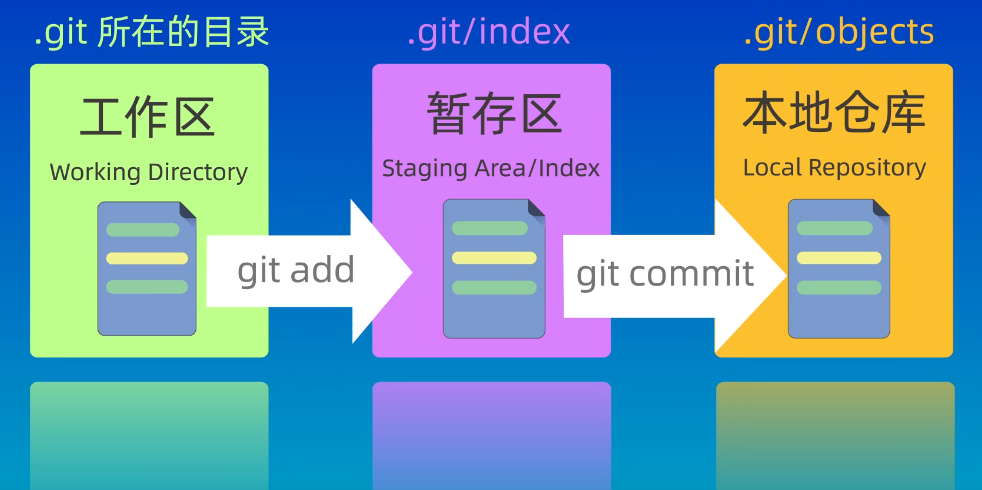
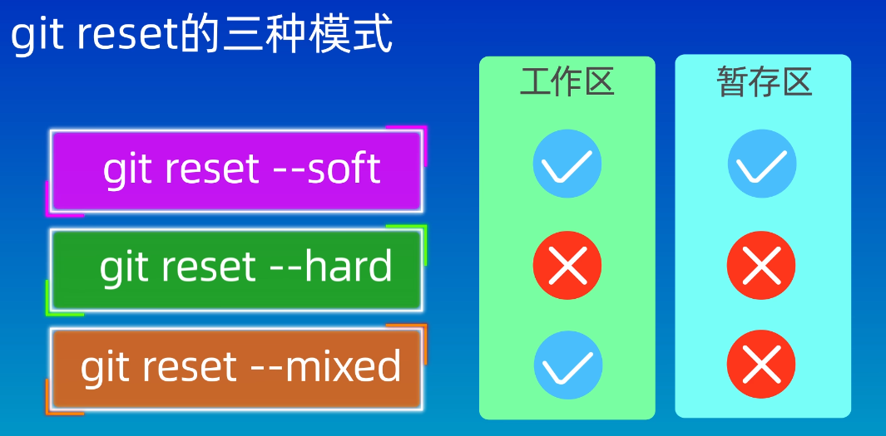
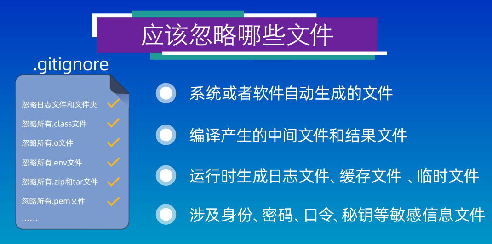
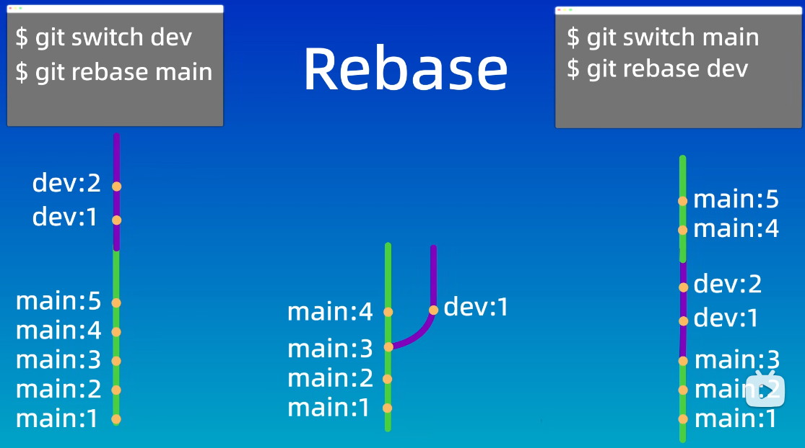

### Git教程

#### 1.初始化配置

下载git后需要将Vscode设置为git的默认编辑器

并进行以下设置：
```bash
git config --global user.name "your name"
git config --global user.email "your email"
```

#### 2.创建仓库

一般有两种方法：git init（本地创建一个仓库）和git clone（远程克隆一个仓库）。

##### (1)git init
```bash
mkdir example
cd example
git init / get init my-repo
ls -a
cd .git
ls -altr # 查看隐藏文件，如.git
```

##### (2)git clone

从云或服务器克隆一个仓库到本地，可以使用HTTPS或SSH方式，使用HTTPS方式每次执行push操作时需要验证用户名和密码，而SSH方式则不需要，只需要在第一次使用时配置SSH密钥即可。
```bash
mkdir example
cd example 
git clone "ssh"
ls -a
```

第一次配置SSH密钥：
```bash
ssh-keygen -t ed25519 -C "your_email@example.com"
# 复制公钥
type %USERPROFILE%\.ssh\id_ed25519.pub 
```
最后将公钥内容复制到github settings中的SSH key中

将远程仓库与本地仓库关联(本地已有仓库)，首先在github创建一个远程仓库:
```bash
cd target_folder
git remote add origin git@github.com:username/repo.git
git remote -v
git push -u origin master
```

使用ssh方式push代码到远程仓库：
```bash
ping github.com
git remote -v
git remote set-url origin git@github.com:Username/RepositoryName.git
git push -u origin master
```

稀疏克隆：

稀疏克隆是指只克隆仓库中的部分内容，而不是整个仓库。这对于大型仓库或只需要特定文件的情况非常有用。使用稀疏克隆可以节省时间和存储空间:
```bash
# 部分克隆 (Partial Clone): 允许只下载文件对象而不需要整个版本历史。
git clone --filter=blob:none <url>
# 稀疏检出 (Sparse Checkout): 克隆后，仅在本地工作区生成指定的文件或目录。
git sparse-checkout init --cone
# 设置想要克隆的目录
git sparse-checkout set <dir1> <dir2>
```

#### 3.工作区域与文件状态

<p align="center">
  
</p>

工作区即本地工作目录，暂存区是一种临时存储区域，用于保存即将提交到Git仓库的修改内容，本地仓库即git init或git clone创建的仓库，包含完整的项目历史和元数据，是Git存储代码和版本信息的主要位置。

#### 4.添加和提交文件

将修改的文件通过git add命令添加到暂存区，然后使用git commit命令将多次add的文件一并提交到本地仓库。在Vscode中，似乎只要有改变就会自动显示在git中：
```bash
echo "Hello World" > file1.txt
git status
git add file1.txt
# 添加所有文件：git add .
# 取消暂存：git rm --cached file1.txt
git status
git ls-files #查看暂存区内容
git commit -m "commit message"
git status
git log
# 一次完成添加暂存和提交两个动作
git commit -a -m "commit message"   # or -am
```

追加提交：
```bash
# 已有新changes
git add .
git commit --amend
```

#### 5.回退版本

三种模式区别在于是否保留工作区、暂存区的修改内容。

```bash
git reset --soft commit_id 
# HEAD^/HEAD~i 表示上一个最新的提交/HEAD~i表示相对于最新提交的前i个提交
git reset --hard commit_id
git reset --mixed commit_id
```
<p align="center">
  
</p>

#### 6.查看文件差异
```bash
git diff                        #比较工作区与暂存区之间的差异
git diff HEAD                   #比较工作区与仓库之间的差异
git diff --cached               #比较暂存区与仓库之间的差异
git diff commit_id1 commit_id2  #比较任意两个提交版本之间的差异
git diff file_name              #比较文件内容
```

#### 7.删除文件
```bash
git rm file_name   # 同时在工作区和暂存区中删除文件
git rm file_name --cached   # 只在暂存区中删除文件
```

#### 8.忽略文件

<p align="center">
  
</p>

```bash
git add file_name > .gitignore #要求该文件不能已经被提交至暂存区中
```

对于已经提交过的文件且不想再被跟踪，可以先使用 git rm --cached file_name 将其从暂存区中删除，然后再将文件名添加到 .gitignore 中。
```bash
git rm --cached file_name        # 删除文件
git rm --cached -r folder_name   # 删除文件夹
```

#### 9.Git中的分支branch

分支可以理解为代码库的不同版本，非常适合团队合作和项目管理。

假设已经存在main分支：

```bash
# 创建一个新分支
git branch new_branch
git switch new_branch
echo "This is a new branch" > new_file.txt
git add .
git commit -m "new branch add a new file"
# 将new_branch分支合并main分支
# 首先进入main分支
git swtich main
git merge new_branch
# 查看分支图
git log --graph --oneline --decorate --all
git branch
# 删除new_branch分支
git branch -d new_branch    #删除一个已经完成合并的分支
git branch -D other_branch  #强制删除一个未完成合并的分支
```

两个分支修改了同一文件的同一行代码，则会出现合并冲突。

出现冲突后如何解决：

```bash
git merge --abort
git status
git diff    # 以<<<<<<<branch1修改内容=======branch2修改内容>>>>>>>的形式显示修改内容
# 修改文件内容后
git add . 
git commit -m "merge conflict"
```

`git apply`的主要作用是将由 `git diff` 或 `git format-patch` 生成的补丁文件（patch）应用到当前工作目录中，以更新代码:
```bash
git diff > feature.patch    # 生成补丁
git apply feature.patch     # 应用补丁
```

#### 10.使用rebase来合并分支

在git中，每个分支都有一个指针指向当前分支的最新提交记录，而在执行rebase操作时，Git会先找到当前分支与目标分支的共同祖先，即图中main分支的main:3提交节点，再将当前分支上该节点后的所有提交都移动到目标分支的提交之后。
<p align="center">
    
</p>

merge和rebase的优缺点对比：

| 操作 | 优点 | 缺点 |
| --- |--- |---|
| **merge** |  不会破坏原分支的提交历史，方便回溯和查看。 | 会产生额外的提交节点，分支图较复杂。|
| **rebase** | 不会新增额外的提交记录，形成线性历史，比较直观和干净。 | 会改变提交历史，避免在共享分支使用。 |

#### 11.从远程仓库拉取内容
```bash
git pull origin main
git fetch origin main # 只是获取远程仓库的修改，仍需要手动进行合并
```

#### 12.获取所有分支的最新状态
```bash
git fetch --all
```

#### 13.将分支检出到独立文件夹
```bash
git worktree add ../new_worktree main
cd ../new_worktree
```

#### 14.删除git文件
```bash
git status
\rm -rf .git
```

## Conventional Commits 规范

Conventional Commits 是一种标准化的提交消息格式，让提交历史更易读，并能被工具自动化处理（如自动生成 CHANGELOG、语义化版本号）。

#### 1. 基本格式

```
<type>(<scope>): <subject>
<空行>
[body]
<空行>
[footer]
```

- **type**：提交类型（必填）
- **scope**：影响范围，如模块名、文件名（可选，用括号括起）
- **subject**：简短描述，不超过 72 字符，首字母小写，结尾不加句号（必填）
- **body**：详细描述，说明做了什么、为什么这样做（可选）
- **footer**：关联 Issue、Breaking Change 说明（可选）

#### 2. 常用 type 类型

| type | 说明 | 是否影响版本号 |
|------|------|--------------|
| `feat` | 新增功能 | Minor 版本 ↑ |
| `fix` | 修复 Bug | Patch 版本 ↑ |
| `docs` | 仅修改文档 | 不影响 |
| `style` | 格式调整（空格、分号等，不影响逻辑） | 不影响 |
| `refactor` | 重构（既不是新功能也不是 Bug 修复） | 不影响 |
| `perf` | 性能优化 | Patch 版本 ↑ |
| `test` | 添加或修改测试 | 不影响 |
| `build` | 构建系统或外部依赖变更（如 cmake、pip）| 不影响 |
| `ci` | CI 配置文件修改（如 GitHub Actions）| 不影响 |
| `chore` | 杂项维护（不修改 src 或 test 文件）| 不影响 |
| `revert` | 回退某次提交 | 视情况 |

#### 3. 提交示例

```bash
# 新增功能
git commit -m "feat(auth): add JWT token refresh logic"

# Bug 修复
git commit -m "fix(parser): handle empty input string correctly"

# 文档更新
git commit -m "docs(readme): update installation steps for Windows"

# 重构（不改变行为）
git commit -m "refactor(loader): extract data preprocessing into separate function"

# 破坏性变更（Breaking Change）—— type 后加 ! 或在 footer 中声明
git commit -m "feat(api)!: rename /v1/predict to /v2/infer"
# 或者用 footer 方式：
git commit -m "feat(api): rename prediction endpoint

BREAKING CHANGE: /v1/predict has been renamed to /v2/infer.
Update all clients accordingly."

# 关联 Issue（footer）
git commit -m "fix(training): fix NaN loss when batch size is 1

Closes #42"

# 多行 body（使用 -m 多次或编辑器）
git commit   # 打开编辑器写多行
```

#### 4. 与语义化版本（SemVer）的对应关系

```
MAJOR.MINOR.PATCH   e.g. 2.1.3

feat      →  MINOR +1  (2.1.3 → 2.2.0)
fix/perf  →  PATCH +1  (2.1.3 → 2.1.4)
BREAKING CHANGE  →  MAJOR +1  (2.1.3 → 3.0.0)
```

#### 5. 配合工具使用

```bash
# commitizen：交互式生成规范提交消息
npm install -g commitizen cz-conventional-changelog
echo '{ "path": "cz-conventional-changelog" }' > ~/.czrc
git cz   # 代替 git commit，进入交互式提问

# commitlint：在 git hook 中校验提交消息是否合规
npm install -D @commitlint/cli @commitlint/config-conventional
echo "module.exports = {extends: ['@commitlint/config-conventional']}" > commitlint.config.js
# 配合 husky（git hook 管理工具）
npx husky add .husky/commit-msg 'npx --no -- commitlint --edit "$1"'

# standard-version / release-please：自动生成 CHANGELOG 并打 tag
npx standard-version          # 分析提交记录，自动升级版本号并生成 CHANGELOG.md
npx standard-version --dry-run # 预览，不实际执行
```

#### 6. `.commitlintrc` 配置示例

```json
{
  "extends": ["@commitlint/config-conventional"],
  "rules": {
    "type-enum": [2, "always", [
      "feat", "fix", "docs", "style", "refactor",
      "perf", "test", "build", "ci", "chore", "revert"
    ]],
    "subject-max-length": [2, "always", 72],
    "subject-case": [2, "always", "lower-case"]
  }
}
```
