# 大语言模型基础

## NLP
Natural Language Processing，即自然语言处理，是语言学、计算机科学和人工智能的跨学科子领域，关注计算机和人类语言之间的交互，特别是如何编程使计算机能够处理和分析大量的自然语言数据。其目标是使计算机能够“理解"文档的内容，包括其中的语言背景细微差别。然后，这项技术可以准确提取文档中包含的信息和见解，以及对文档本身进行分类和组织。本质上是一个“填字游戏”，基于条件概率$p(y|x)$。

<p align="center">
  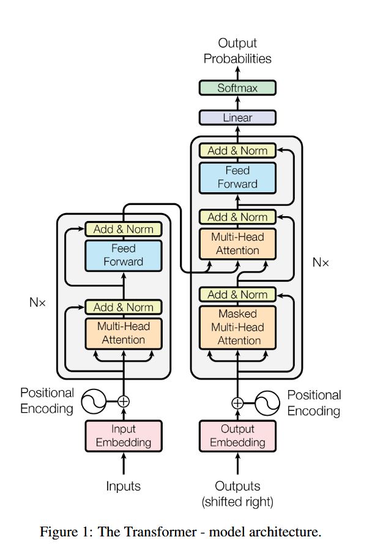
</p>

### Decoder-encoder

Google BERT使用的方法。由经典的Transformer图片可以看到，左侧理解输入，并通过encoder编码器输出给右侧的decoder，最后进行输出。

### Decoder-only

GPT(Generative Pre-trained Transformer)使用的方法。将encoder部分删除，只保留decoder部分，相当于将理解的任务也交给decoder。

**举一个比较形象的例子就是，decoder-encoder方法可以理解为“完形填空”，而decoder-only方法则可以理解为“词语接龙”。在使用模型时，通常的方式是提问，即形式偏向于“词语接龙”。**

## Input Embedding

### 嵌入(Embedding)

将自然语言翻译为token以供大模型理解和处理，每个模型都有一个独特的embedding table，其大小为[vacob_size, hidden_dim/d_model]，记录了模型已知的所有词。同时，每个模型会自带tokenizer，起作用为将用户输入的信息进行分词，得到一系列token，并得到token_id。通过查询这些token_id，就能将自然语言转换为大模型能够理解的信息。

### Tokenizer

尝试[Tiktokenizer](https://github.com/openai/tiktoken)：

<p align="center">
  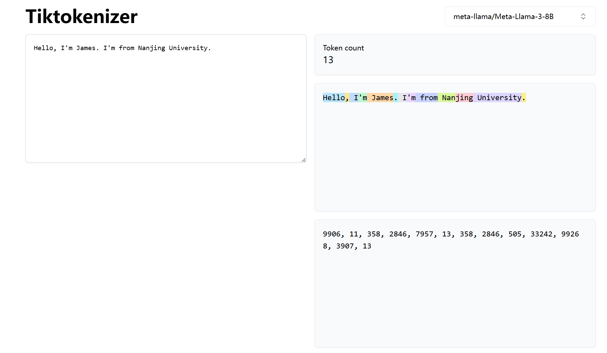
</p>

用以下方式加载模型对应的tokenizer:

```python
import transformers
print(transformers.__version__)
from transformers import AutoModelForCausalLM, AutoTokenizer
model_id = ""
tokenizer = AutoTokenizer.from_pretrained(model_id)
```

使用方法：
  * `tokenizer(input)` - 完整编码，返回字典
  * `tokenizer.tokenize(input)` - 只分词，返回字符串列表
  * `tokenizer.encode(input)` - 编码为ID，可选择特殊符号
  * `tokenizer.decode(input)` - 解码ID为文本

#### Tokenizer的返回值

除了input_ids外，tokenizer还会返回attention_mask（这里的attention mask注意要和后面的因果attention mask区分一下），表示哪些token是有效的，哪些是padding的无效token。1表示有效，0表示无效。

```python
encoded = tokenizer(text)
print(encoded)
 {'input_ids': [128000, 59563, 47653, 102667, 128001], 
  'attention_mask': [1, 1, 1, 1, 1]}
```

#### 编码与解码

`tokenizer(input)`: 得到{'input_ids','attention_mask'}字典结构

`tokenizer.tokenize(input)`: 得到tokens

`tokenizer.encode(input)`: 得到tokens的ids

`tokenizer.decode(input)`: 得到文本，为ids的List

#### Tokenizer基本操作

##### Padding，补齐

当对一批长度不一的文本进行tokenizer时，可以使用`padding=True`参数让tokenizer自动对齐长度，默认会对齐到该批次中最长文本的长度。

```python
batch_sentences = [
    "Tell me a story about Nanjing University.",
    "大语言模型课程怎么考试？",
]
encoded_inputs = tokenizer(batch_sentences)
print(encoded_inputs)
encoded_input_padding_true = tokenizer(batch_sentences, padding=True)
print(encoded_input_padding_true)
```

```python
# 指定长度进行padding
encoded_input = tokenizer(batch_sentences, padding="max_length", max_length=20, truncation=True)
```

控制padding方向：

在模型推理过程中，一般使用左侧padding，即在序列的左侧添加padding token，使得有效token位于序列的右侧。这种方式有助于模型更好地捕捉序列的上下文信息，便于模型生成下一个token，尤其是在处理变长输入时。

```python
tokenizer.padding_side = 'left'
encoded_input = tokenizer(batch_sentences, padding="max_length", max_length=20, truncation=True)
```

##### Truncation，截断

训练时可能遇到某个样本非常长的情况，该组内其他所有batch都使用大量padding token补0，导致整体的tensor非常大，进而内存出现OOM(out of memory)的情况，这时候就需要用到truncation进行截断。

### 位置编码(PE, Positional embenddings)

位置编码用来标记每个token的位置。由于Transformer架构的核心组件（Self-Attention 机制）是并行处理输入序列中的所有词（Token）的，它本身不具备捕捉序列顺序的能力（即它无法区分“猫追狗”和“狗追猫”的区别，因为它只关注词与词之间的关联度，而不关注谁在前谁在后），本质上是衡量token与token之间的相关性。从自然语言的角度思考，考虑相关就必须带入某种语境，位置编码就是为了解决这个问题引入的。它为输入序列中的每个位置分配一个独特的向量，并将这个向量与对应位置的 Token Embedding 相加（或旋转），从而将“位置信息”注入到模型中，让LLM更好地建模不同位置的token之间的关系。

<p align="center">
  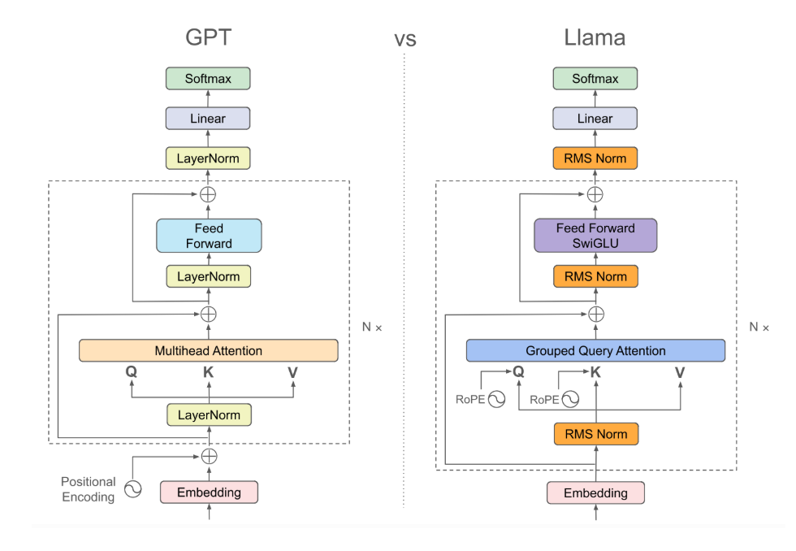
</p>

位置编码的重要性：
 - 赋予序列感：它是模型理解语言语序的关键。没有位置编码，Transformer 就退化成了一个“词袋”模型（Bag-of-Words），只能处理词汇共现关系，无法理解语法结构和逻辑顺序。
 - 区分相同词汇：如果一个句子中出现了两次相同的词（例如“The dog ate the bone”中的两个 "the"），如果没有位置编码，模型会认为它们是完全一样的输入；有了位置编码，模型就能根据它们在句子中的位置区分它们。
 - 长距离依赖：合适的位置编码（如旋转位置编码 RoPE）有助于模型更好地处理长文本，捕捉距离较远的词之间的关系。

##### 绝对位置编码

直接在每个token的embedding上线性叠加位置编码: $x_i + p_i$，其中$p_i$为可训练的向量，例子为[Attention is all you need](https://arxiv.org/abs/1706.03762)中的sinusoidal PE。

使用sin方法的绝对位置编码的劣势：

##### 旋转位置编码(RoPE, Rotary PE)

通过叠加旋转位置编码的方式由加法改乘法。假设两个token的embedding为$x_m$和$x_n$，$m$和$n$分别代表两个token的位置，目标找到一个等价的位置编码方式，使得下述等式成立：
$$ \left \langle   f_q(x_m,m),f_k(x_n,n) \right \rangle=g(x_m,x_n,m-n)$$

[RoFormer](https://arxiv.org/abs/2104.09864)提出Rotary PE，在embedding维度为2的情况下：
$$\begin{aligned}
f_{q}\left(\boldsymbol{x}_{m}, m\right) & =\left(\boldsymbol{W}_{q} \boldsymbol{x}_{m}\right) e^{i m \theta} \\
f_{k}\left(\boldsymbol{x}_{n}, n\right) & =\left(\boldsymbol{W}_{k} \boldsymbol{x}_{n}\right) e^{i n \theta} \\
g\left(\boldsymbol{x}_{m}, \boldsymbol{x}_{n}, m-n\right) & =\operatorname{Re}\left[\left(\boldsymbol{W}_{q} \boldsymbol{x}_{m}\right)\left(\boldsymbol{W}_{k} \boldsymbol{x}_{n}\right)^{*} e^{i(m-n) \theta}\right]
\end{aligned}
$$


RoPE的可视化展示：

<p align="center">
  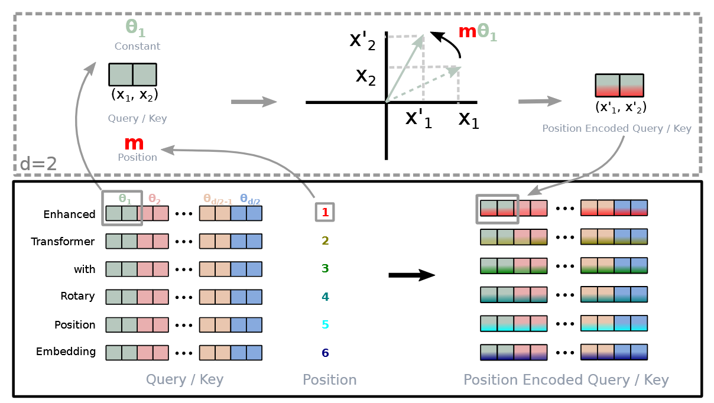
</p>

RoPE在LlaMA中的构建：

不同于经典Transformers结构，只对输入的token做位置编码的叠加，LlaMA中的RoPE在Transformer的每一层都会对Q和K进行位置编码的叠加。

<p align="center">
  
</p>

RoPE的代码实现：

<p align="center">
  
</p>

对于维度大小为(batch_size=1, seq_len, dim)的token来说，m表示每个token的具体位置（m对应seq_len），对于某一个具体的m，从n维实现的图中可以看出，每两个dim共用一个$\theta$，因此只需要$d=\dim/2$即可。

- 基础频率：$\theta_i = \text{base}^{-2i/d}$，常用$\text{base}=10000$
- 位置角度：$\theta_{n,i} = n\,\theta_i$，其中$n$为token位置，$i$为维度对索引

```python
import torch

def build_rope_cache(seq_len, dim, base=10000, device=None):
    device = device or torch.device('cpu')
    position = torch.arange(seq_len, dtype=torch.float32, device=device)
    dim_idx = torch.arange(dim // 2, dtype=torch.float32, device=device)
    inv_freq = base ** (-dim_idx / (dim // 2))
    # 计算外积，得到(seq_len, dim/2)维度的m\theta/2
    freqs = torch.outer(position, inv_freq) 
    cos = torch.cos(freqs) # shape=(seq_len, dim/2)
    sin = torch.sin(freqs) # shape=(seq_len, dim/2)
    return cos, sin

def apply_rope(x, cos, sin):
    cos = cos.unsqueeze(0) # shape=(1, seq_len, dim/2)
    sin = sin.unsqueeze(0) # shape=(1, seq_len, dim/2)
    x_even = x[..., ::2] # 偶数列
    x_odd = x[..., 1::2] # 奇数列
    rotated_even = x_even * cos + x_odd * sin
    rotated_odd = x_odd * cos - x_even * sin
    # 最后两个维度展平
    rotated = torch.stack([rotated_even, rotated_odd], dim=-1).flatten(-2)  
    return rotated

seq_len, dim = 4, 8 # dim一般为耦合
hidden_states = torch.arange(seq_len * dim, dtype=torch.float32).view(1, seq_len, dim)
cos, sin = build_rope_cache(seq_len, dim, device=hidden_states.device)
rope_hidden = apply_rope(hidden_states, cos, sin)
print('original token 0:', hidden_states)
print('after RoPE    :', rope_hidden)
```

## Norm

即标准化/归一化(Normalization)。对输入的embedding token以及训练循环中的outputs进行归一化，作用主要是调整数据的分布，加速训练收敛，让输入更“规整”，降低过拟合(overfitting)，增强泛化(generalization)，以下图为例，当对一个二维tensor进行训练时，若一个维度的数值远大于另一维，则更新迭代过程中该维度会占据主导地位。因此，适当的归一化能够防止数值在传播过程中过大或过小，使优化过程更平滑。

<p align="center">
  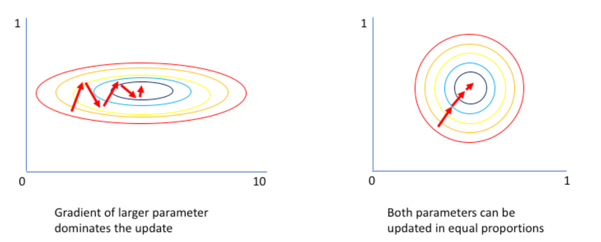
</p>

Normalization v.s. Regularization：

目标不同：
  * Normalization=调整数据
    * 比如: $X'=X-\frac{X_{\min}}{X_{\max}-X_{\min}}$
  * Regularization=调整预测/损失函数
    * 比如: $\text{loss}=\min\sum_{i=1}^N L(f(x_i), y_i)+\lambda R(\theta_f)$

大语言模型引入Normalization：

* 原始输入: vocab embedding
    * tensor shape: <batch_size, sequence_length, hidden_dim>
* 深度学习模型中间层表示(hidden states/representations)
      * tensor shape: <batch_size, sequence_length, hidden_dim>

对于embedding token，通常情况下batch_size和sequence_length都是不确定的，而hidden_dim一般确定，如4096等，所以一般针对每个token在hidden_dim维度上做标准化，避免依赖batch/sequence。
* 选择最合适的Normalization维度->LayerNrom
  * batch：X=[batch_size,sequence_length, hidden_dim]
  * sequence： X=[sequence_length, hidden_dim]
  * hidden: <bs, seq, hidden> => <N, hidden>, X=[hidden_dim]

##### RMSNorm
当前流行的LayerNorm：[RMSNorm](https://arxiv.org/pdf/1910.07467)

torch 2.8，提供了RMSNorm类的实现[torch.nn.RMSNorm](https://pytorch.org/docs/stable/generated/torch.nn.RMSNorm.html#torch.nn.RMSNorm)

手搓RMSNorm：

$$ y_i = \frac{x_i}{\text{RMS}(x)}*\gamma_i $$

$$ \text{RMS}(x)=\sqrt{\frac{\sum_{i=1}^N x_i^2}{N}+\epsilon} $$

其中$\epsilon$为一个极小的非零量，保证分母不为0；$\gamma$为训练参数。

```python
import torch.nn as nn

input = torch.randn(2, 3, 4, requires_grad=True)
print(input)
print(input.mean(-1, keepdim=True)) # keepdim隐藏时默认置为False，表示不保留mean的维度
print(input.mean(-1, keepdim=True).shape)
print(input.mean(1))
print(input.mean(1).shape)
```

```python
# 手搓
variance_epsilon = 1e-6
input = input.to(torch.float32)
RMS = (input.pow(2).mean(-1, keepdim=True) + variance_epsilon).rsqrt()
RMSNorm = input * RMS
print(RMS.shape)
print(RMSNorm)
print(RMSNorm.shape)
# 使用pytorch自带的RMSNorm实现
layerNorm = nn.RMSNorm([4])
RMSNorm1 = layerNorm(input)
print(RMSNorm1)
print(torch.allclose(RMSNorm, RMSNorm1))
```

## Transformer

### Attention Mechanism

注意力机制为Transformer架构的核心，它决定了模型如何理解上下文。注意力机制本质上是一个“基于内容的寻址过程”，可以将它想象成数据库查询：

- Q(Query):当前的token，“我要找什么”
- K(Key):序列中所有token的标签(可以理解为字典中键值对的“键”)，“哪里有我想要的”
- V(Value):序列中所有token的内容(可以理解为字典中键值对的“值”)，“我想要的内容是什么”

打印一下LlaMA的Attention可以得到：

```python
(self_attn): LlamaAttention(
  (q_proj): Linear(in_features=2048, out_features=2048, bias=False)
  (k_proj): Linear(in_features=2048, out_features=512, bias=False)
  (v_proj): Linear(in_features=2048, out_features=512, bias=False)
  (o_proj): Linear(in_features=2048, out_features=2048, bias=False)
  (rotary_emb): LlamaRotaryEmbedding()
)
```

Attention内部结构：

4个Linear层：q_proj、k_proj、v_proj、o_proj，本质上几种不同的“投影”方式；

推理视角(Forward，bp靠Autograd自动求导):
  $$\text{head}=\text{Attention}(Q,K,V)=\text{softmax}(\frac{QK^T}{\sqrt{d_k}})V$$

给定由一段样本通过tokenizer得到的Input Embedding，共有batch_size段，每段的长度为seq_len，Embedding table中的维度为hidden_dim，记为$X$，其shape为：[batch_size, seq_len, hidden_size]。

前向传播得到$Q,K,V$（通过linear.module）：
  * $Q=\text{q\_proj}(X)=XW_Q$，$W_Q$的shape: [hidden_size, hidden_size]
  * $K=\text{k\_proj}(X)=XW_K$，$W_K$的shape: [hidden_size, hidden_size]
  * $V=\text{v\_proj}(X)=XW_V$，$W_V$的shape: [hidden_size, hidden_size]

Step1：得到$Q,K,V$

设N = batch_size * seq_len, d = hidden_dim

<p align="center">
  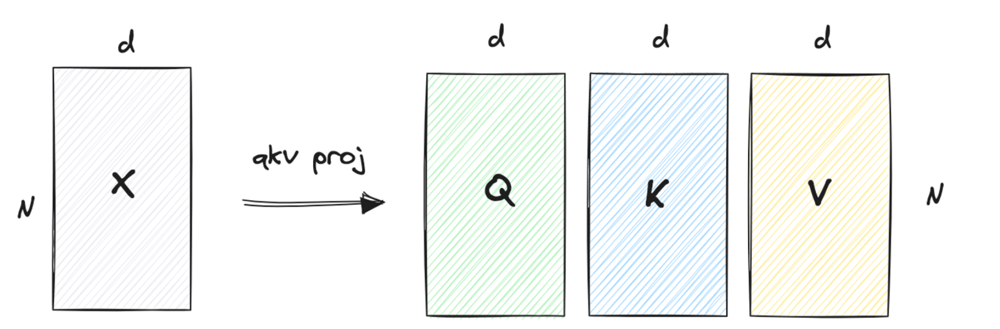
</p>

Step2：计算$QK^T$

$P=\text{mask}(\frac{QK^\top}{\sqrt{d_k}}+bias)$，本质上是计算查询和键的相关性（相似度矩阵），数值上越大表示两者在语义上的相关性越大。$\sqrt{d_K}$为缩放因子，防止内积过大。

<p align="center">
  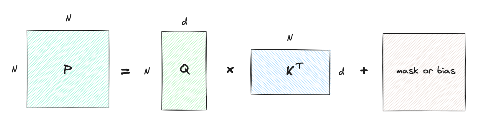
</p>

Step3：计算$\text{Attention}$

给定$P$，计算$A=\text{softmax}(P)$，相当于按照行进行归一化为概率分布。

softmax一般计算方式：$softmax(x)=\frac{e^x}{\sum{e^x}}$，实际使用过程中一般会在指数上减去m(m=row_max)，防止指数爆炸，转为浮点数；diag用于将一维tensor转换成对角线上放置对应值、其他全0的方阵。
$$ l=\text{row\_sum}(S),S=\text{exp}(P-m),m=\text{row\_max}(P) $$
$$ \text{row-wise softmax}: A_i = \text{softmax}(P_i)=\text{diag}(l)^{-1}S $$

<p align="center">
  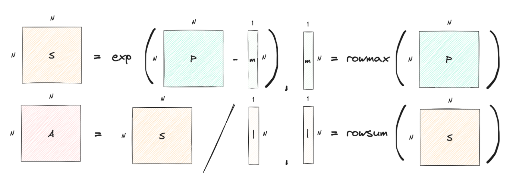
</p>

Step4：计算输出$O$

$O=AV$，根据概率加权聚合信息。

<p align="center">
  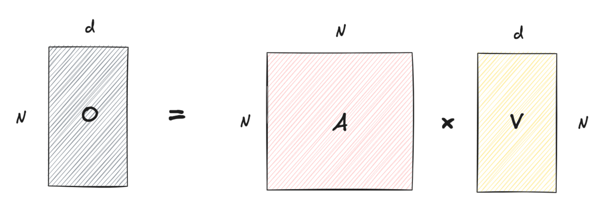
</p>

mask的作用：

- padding mask：在实际情况中由于每句话都长短不一，对每个seq的划分需要以最长seq为基准补全，补全的部分称为padding token(参考tokenizer部分的mask)。为了避免padding对attention的影响，在计算$P$时，我们可以将padding的部分设置为一个很大的数，如$-\infty$。

- causal attention mask(因果mask)：当前token只与历史token有关，与未来token无关，对于第i个token，需要屏蔽i+1及后续token对它的影响。

##### Attention的实现

```python
import torch
import torch.nn as nn
import torch.nn.functional as F
import math

torch.manual_seed(42)
torch.set_printoptions(precision=4, sci_mode=False)
print(f"PyTorch version: {torch.__version__}")
```

```python
# 从hidden_state得到QKV
batch_size, seq_len = 2, 4
num_heads = 4
head_dim = 8
hidden_size = num_heads * head_dim

hidden_states = torch.randn(batch_size, seq_len, hidden_size)

q_proj = nn.Linear(hidden_size, hidden_size, bias=False)
k_proj_full = nn.Linear(hidden_size, hidden_size, bias=False)
v_proj_full = nn.Linear(hidden_size, hidden_size, bias=False)
o_proj = nn.Linear(hidden_size, hidden_size, bias=False)

q = q_proj(hidden_states)
k = k_proj_full(hidden_states)
v = v_proj_full(hidden_states)

print(f"hidden_states shape: {hidden_states.shape}")
print(f"q shape: {q.shape}, k shape: {k.shape}, v shape: {v.shape}")
```

```python
# 只展示因果 mask（decoder 的自回归约束）
scale = 1.0 / math.sqrt(hidden_size)
scores = torch.matmul(q, k.transpose(-2, -1)) * scale
# 首先构建一个全1的方阵，然后使用triu函数将上三角部分全置为True，将该tensor作为mask
causal_mask = torch.triu(torch.ones(seq_len, seq_len, dtype=torch.bool), diagonal=1)
scores_masked = scores.masked_fill(causal_mask, float('-inf'))
# 使用pytorch的F函数
attn_weights = F.softmax(scores_masked, dim=-1)
context_single = torch.matmul(attn_weights, v)

print('scores shape:', scores.shape)
print('attention weights sums:', attn_weights.sum(dim=-1))
print('context_single shape:', context_single.shape)
print(causal_mask)
print(scores_masked)
```

```python
def stable_softmax(x: torch.Tensor) -> torch.Tensor:
    x_max = torch.nan_to_num(x.max(dim=-1, keepdim=True).values)
    x_exp = torch.exp(x - x_max)
    return x_exp / x_exp.sum(dim=-1, keepdim=True)

manual_weights = stable_softmax(scores_masked)
print('manual == torch.softmax?', torch.allclose(manual_weights, attn_weights, atol=1e-6))
```

#### 多头注意力

##### MHA(Multi-head Attention)

在单头注意力中，计算$QK^T$会将所有信息压缩成唯一的一组注意力分数。而在实际情况中，在实践中，当给定相同的查询、键和值的集合时，希望模型可以基于相同的注意力机制学习到不同的行为，然后将不同的行为作为知识组合起来，捕获序列内各种范围的依赖关系（例如，短距离依赖和长距离依赖关系）。因此，允许注意力机制组合使用查询、键和值的不同子空间表示（representation subspaces）可能是有益的。

给定$Q,K,V$ (shape [bs, seq, hs]),shape简化为$N\times d$
* 多个heads
  * $Q=[Q_1,Q_2,...,Q_h]$
  * $K=[K_1,K_2,...,K_h]$
  * $V=[V_1,V_2,...,V_h]$
* shape的变换(tensor.view实现): [N, d] -> [N, num_heads, head_dim]
  * 其中, d = hidden_size = num_heads * head_dim
  * 实现中，[bs, seq, hs] -> [bs, seq, nh, hd], 再transpose为[bs, nh, seq, hd]

##### MQA(Multi-query Attention)

多个Query对应单个Key/Value，但会出现性能上的问题，即获取不到多角度的特征表示，导致模型表达能力下降。为了解决这个问题，提出了GQA(Grouped-query Attention)。

##### GQA(Grouped-query Attention)

介于MQA和MHA之间的一种折中方案，提出GQA(Grouped-query Attention)，即将多个query头分组，每组共享一套key/value头，num_key_value_heads=g。
* **推理显存**：每个token的KV缓存从$h\times d_k$降为$g\times d_k$，长上下文推理显存压力显著降低
* **吞吐表现**：减少`k_proj`/`v_proj`的矩阵乘与显存访问，提升批量推理吞吐
* **模型实践**：Llama-2/3、Gemma、Mistral等开源模型默认启用GQA (`num_key_value_heads=g`)
* **表达能力**：合理选择$g$（常见$g=h/2$或$h/4$）可兼顾速度与精度，分组过大可能削弱头部多样性

直观展示集中多头注意力机制的区别：

<p align="center">
  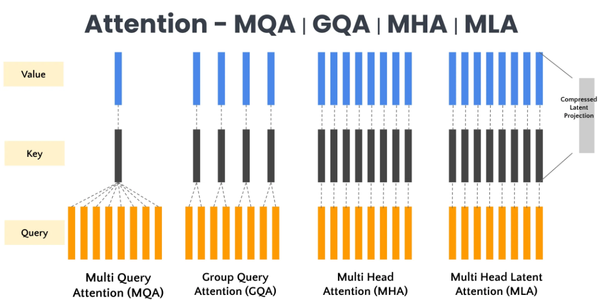
</p>

$QK^\top$的计算过程是$O(N^2)$的复杂度，那么多头的情况下，$QK^\top$的计算复杂度是$O(hN^2)，实际上，实际上，可依赖GPU并行执行提升速度。

#### BlockedAttention

使用BlockedAttention进行计算：

$$\left\{\begin{array}{ll}Q = \left[Q_{1}, . ., Q_{N_{q}}\right], & N_{q} = \frac{N}{B_{q}} \\K = \left[K_{1}, .,, K_{N_{k}}\right], V = \left[V_{1}, . ., V_{N_{k}}\right], & N_{k} = \frac{N}{B_{k}}\end{array}\right.$$

<p align="center">
  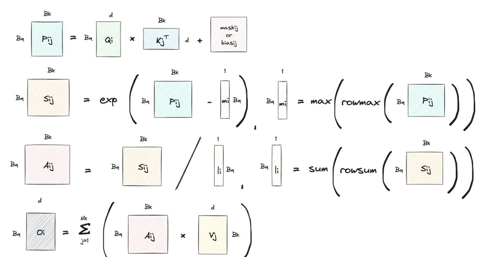
</p>

* 实现时不能对每个块单独归一化后直接拼接，否则等效于多个softmax
* 需要维护全局的行最大值$m_i$与行和$l_i$，新块的贡献使用$e^{P_{block}-m_i}$缩放后累加
* 这是FlashAttention等实现中的通用做法，可避免溢出并保证与标准Attention一致

#### FlashAttention

##### GPU工作原理

从抽象的角度看，GPU 的组件包括：

- SRAM(Static Random Access Memory)

内部含有若干个Streaming Multiprocessors(SM)，L1 cache位于SM内部，共同组成L2 cache，L2为所有SM都能访问到，速度比全局内存块，所以为了提高速度有些小的数据可以缓存到L2上面；L1用于存储SM内的数据，SM内的运算单元能够共享，但跨SM之间的L1不能相互访问；

- DRAM(Dynamic Random Access Memory)

显存，又称为High-Bandwidth Memory，即HBM。以A100为例，其L2 cache(40MB)共有108个SM，传输速度约为19TB/S，每块内存大小为192KB；而HBM的传输速度为1.5T/s，内存大小为80GB。

所有的on-chip memory，包括register和shared memory，都是SRAM；所有的off-chip memory，包括global、local、constants、texture memory都是DRAM。Global Memory是典型的off-chip memory，但处理数据时，总是会被缓存到L2中，当满足一些更严格的条件时会进一步被缓存到L1中。

Tiling技术是把大矩阵切成适合硬件缓存的子矩阵块，保持二维结构，通常形状固定，每个tile所需的数据能够装入 shared memory 或 register，减少重复访问 global memory，Tiling技术可以让不同 block 独立工作，提高并行度，并避免单个 block 的线程或寄存器需求超出硬件上限。

GPU中的内存处理层级结构：

<p align="center">
  
</p>

##### 从GPU到FlashAttention

FlashAttention 的核心目标是把 Q/K/V 的计算尽量留在 register 与 shared memory，减少对 global memory（HBM）的往返。

标准的Self Attention中，考虑一次$O=\text{Softmax}(\frac{QK^T}{\sqrt{d_k}})V$的过程：

<p align="center">
  
</p>

在这个过程中，一共包含了 8 次需要访问 HBM 的操作
  * 第 1 行：读 Q、K，写 S
  * 第 2 行：读 S，写 P
  * 第 3 行：读 P、V，写 O

HBM 访问成本： $𝑶(𝑁𝑑+𝑁^2)$，$𝑁$ 表示seq_len * batch_size， $𝑑$ 表示 head_dim

考虑两个32×32大小的矩阵乘法，block为16×16，直接运算时每个位置需要访问Global Memory2\*32次（行与列均遍历），总共需要访问Global Memory 2\*32\*32\*32=65536次；而使用Tiling技术后，虽然总计算量不变，但每个block只需要访问Global Memory 16\*16\*4（分成4块）次=1024次，计算完整的C则需要1024\*4=4096次，为原来的1/16，具体流程如下图所示：

<p align="center">
  
</p>

不幸的是，从softmax的计算式中可以看到，仅计算出$𝑪_{𝟎,𝟎}$ 的情况下，无法计算 softmax 的值，因为 softmax 的值还依赖于 $𝑪_{𝟎,𝟏}$，因此 Tiling 技术仅仅减少了标准 Attention 算法中矩阵乘法的实际 global memory 访问次数，但是并没有从整体上改变标准 Attention 算法的流程。

从Softmax计算方式角度考虑：

Safe Softmax可以有效防止指数爆炸，$\frac{e^{x_{i}}}{\sum_{j=1}^{N} e^{x_{j}}}=\frac{e^{x_{i}-m}}{\sum_{j=1}^{N} e^{x_{j}-m}}$，其中$m= \text{max}^N_{j=1}(x_j)$，其本质是将任意实数向量归一为“概率分布”。

直接计算 $\sum_j e^{x_j}$ 容易溢出/下溢：
* $x_i=100 \Rightarrow e^{x_i}\approx 2.7\times 10^{43}$，float16/32 无法表示
* $x_i=-100 \Rightarrow e^{x_i}\approx 3.7\times 10^{-44}$，接近 0 导致梯度消失
* 溢出会产生 `inf`，下溢会得到 0，最终 softmax 可能变成 `NaN`

-->使用LSE(Log-Sum-Exp)技巧稳定计算

定义：$\operatorname{LSE}(x)=\log\left(\sum_j e^{x_j}\right)$，即在 log 域求和，令 $m=\max_j x_j$，写作 $\operatorname{LSE}(x)=m+\log\left(\sum_j e^{x_j-m}\right)$，所有 $x_j-m\le 0$，指数项不会爆炸；且$\dfrac{\partial}{\partial x_i}\operatorname{LSE}(x)=\text{softmax}(x_i)$，反向传播中梯度直接可得。

从这个形式出发，FlashAttention 的 online softmax 正是维护 $m$ 和 $\sum e^{x_j-m}$ 的增量，块级也能稳定计算 LSE。

Online Softmax使得我们可以一边扫描数据，一边动态修正 Softmax 的结果，而不需要等看完所有数据再动手。

从标准Softmax来看，为了数值稳定性（防止 $e^x$ 溢出），需要遍历数据 **3 次**：
$$ \text{Softmax}(x)_i = \frac{e^{x_i - m}}{\sum e^{x_j - m}} $$
1.  **遍历 1**：找出最大值 $m = \max(x)$，本质上是将阶段最大值存入变量中并不断更新。
2.  **遍历 2**：计算分母 $d = \sum e^{x_i - m}$。
3.  **遍历 3**：计算最终结果 $y_i = e^{x_i - m} / d$。

优化思路（2-pass softmax）：消除$d_i$对$m_N$的依赖，记$m_i$为前i个元素的最大值
$$d_i'=\sum_{j=1}^{i} e^{x_j - m_i}$$
$$=(\sum_{j=1}^{i-1} e^{x_j - m_i})+e^{x_i - m_i}$$
$$=(\sum_{j=1}^{i-1} e^{x_j - m_{i-1}})e^{m_{i-1}-m_{i}}+e^{x_i - m_i}$$
$$=d_{i-1}'e^{m_{i-1}-m_i}+e^{x_i - m_i}$$

考虑到最终结果需要求$O$，如下为一种 2-pass 的 Self Attention 的算法（V1）：
<p align="center">
  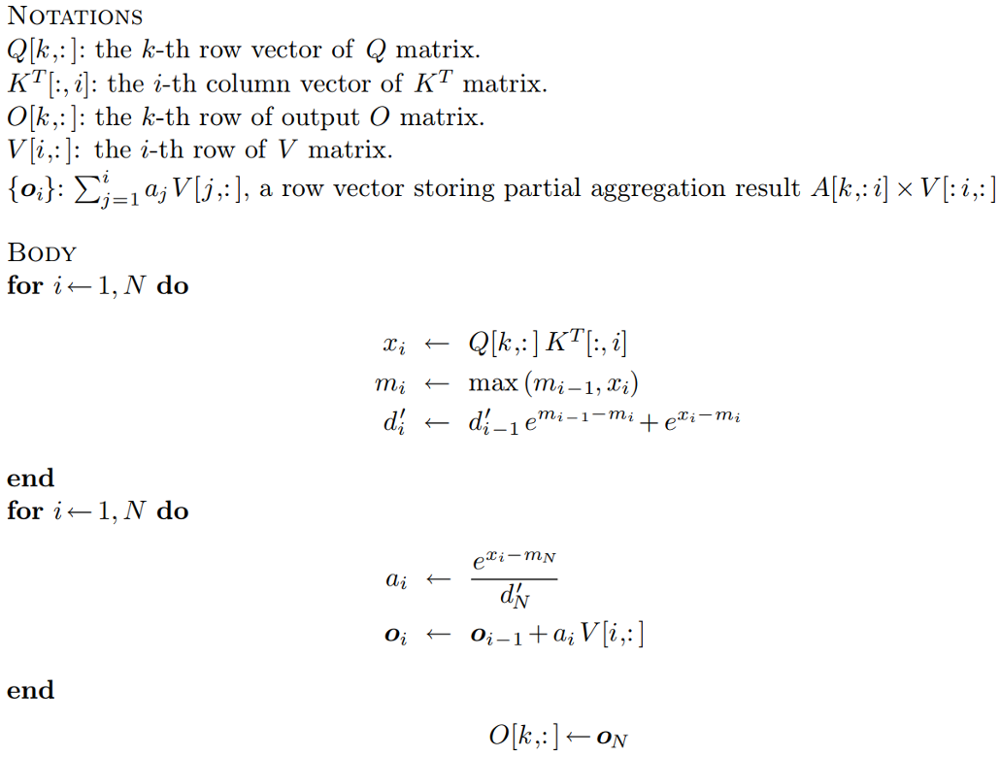
</p>

继续改良得到 V2 版本：
<p align="center">
  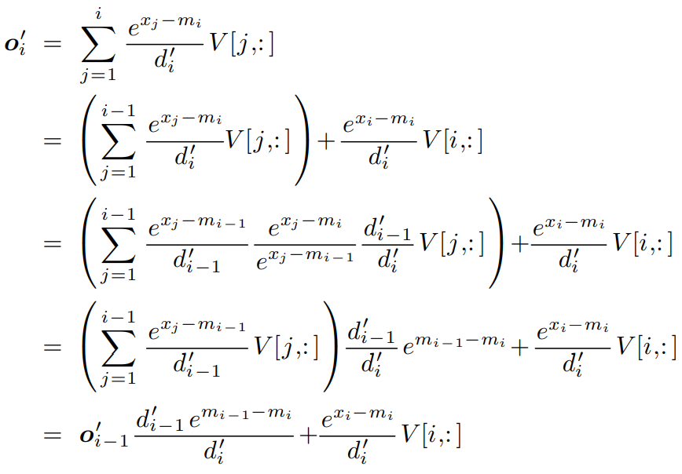
</p>

### MLP 

<p align="center">
  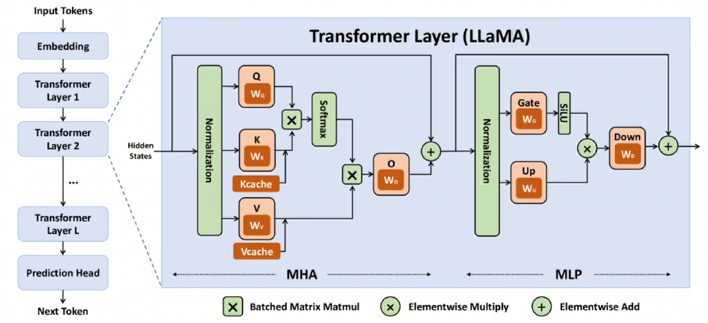
</p>

在Transformer的多层感知机(MLP, Mulilayer Perceptron)部分，除了 Self-Attention 负责“混合”不同 token 之间的信息外，还有一个独立处理每个 token 的前馈神经网络(FFN, Feed Forward Network)。

如果说 Self-Attention 是让词与词之间“对话”（建立上下文联系），那么 FFN 就是让每个词“反思”和“加工”自己。

- 知识存储与记忆：

研究表明，FFN 的参数矩阵中存储了大量的具体知识（例如“法国的首都是巴黎”这种事实性知识可能就编码在 FFN 的权重里）。
- 增加非线性/复杂性：

没有激活函数的神经网络堆叠再多层也等价于一层线性变换。FFN 中的激活函数赋予了模型拟合复杂抽象概念的能力。
- 维度变换与特征提取：
  
FFN 通常会将隐层维度放大（例如 LLaMA 中从 4096 放大到 11008 再变回 4096），在这个高维空间中，模型可以更细致地解耦和处理特征。

#### FFN实现

LlamaMLP：

```python
(mlp): LlamaMLP(
  (gate_proj): Linear(in_features=2048, out_features=8192, bias=False)
  (up_proj): Linear(in_features=2048, out_features=8192, bias=False)
  (down_proj): Linear(in_features=8192, out_features=2048, bias=False)
  (act_fn): SiLU()
)
```
组件：三个nn.Linear层（gate、up、down），一个SiLU激活函数
  * SiLU: torch.nn.functional.silu(x)
  * Linear: torch.nn.Linear(in_features, out_features)
  
输入$x$同时进入 gate 和 up，gate 的输出经过激活函数 (SiLU) 后与 up 的输出相乘，结果再通过 down 映射回原来的维度。

#### FFN流程

* 输入tensor: <batch_size, sequence_length, hidden_dim>
* 第一步：
  * 通过gate_proj获得gate tensor'，经过SiLU激活得到gate tensor
  * 通过up_proj获得up tensor
* 第二步：元素乘(elementwise multiply): gate tensor 和 up tensor
* 第三步: 通过down_proj获得down tensor

#### 激活函数

激活函数的核心作用是引入非线性。如果没有激活函数，无论神经网络由多少层线性变换（矩阵乘法）堆叠而成，它最终都等价于单层的线性变换，无法学习复杂的模式。

##### 1. Sigmoid (S型函数)
这是最早期的激活函数之一，来自于统计学中的逻辑回归。

*   **公式**: $\sigma(x) = \frac{1}{1 + e^{-x}}$
*   **图像**: 将所有输入压缩到 $(0, 1)$ 区间，呈“S”形。
*   **特点**:
    *   **输出范围**: $(0, 1)$。这使得它很适合做概率预测（二分类）。
    *   **平滑性**: 处处可导。
*   **缺点 (为什么现在的大模型很难见到它作为隐层激活函数)**:
    *   **梯度消失 (Gradient Vanishing)**: 当输入非常大或非常小时（饱和区），导数趋近于 0。在深层网络的反向传播中，连乘的梯度会迅速变为 0，导致网络无法训练。
    *   **非零中心 (Not Zero-centered)**: 输出恒为正，这会导致反向传播时权重的更新方向出现锯齿状震荡，收敛变慢。
    *   **计算昂贵**: 指数运算 $e^{-x}$ 在计算机中相对耗时。

##### 2. ReLU (Rectified Linear Unit, 线性整流单元)
为了解决 Sigmoid 的梯度消失问题，ReLU 应运而生，并成为了深度学习爆发时期的标配。

*   **公式**: $f(x) = \max(0, x)$
*   **图像**: $x < 0$ 时为平线，$x \ge 0$ 时为斜率为 1 的直线。
*   **特点**:
    *   **计算极快**: 只需要判断是否大于 0，没有复杂的数学运算。
    *   **解决梯度消失**: 在正区间（$x>0$）导数恒为 1，梯度可以无损地传回前面的层，非常适合深层网络。
    *   **稀疏性**: 负区间的神经元输出为 0，这让网络具有一定的稀疏激活性，模拟了生物神经元的特性。
*   **缺点**:
    *   **Dead ReLU (神经元死亡)**: 如果某个神经元在训练中陷入负区间，其梯度永远为 0，这个神经元在后续训练中将永远不再被更新（“死掉了”）。

##### 3. SwiGLU (Swish-Gated Linear Unit)
这是目前主流 LLM（如 LLaMA、PaLM、DeepSeek 等）普遍采用的激活函数变体，它是 GLU（门控线性单元）和 Swish 激活函数的结合。

*   **背景 - Swish**: $f(x) = x \cdot \sigma(\beta x)$。它具备“平滑”、“非单调”的特性（负区间有一个小凹坑），在深层模型中表现优于 ReLU。
*   **背景 - GLU (门控制机制)**: 类似于 LSTM 的门控，它有两个线性变换，其中一个作为“门”控制另一个的信息流：$GLU(x) = (xW) \cdot \sigma(xV)$。
*   **SwiGLU 公式**:
    $$ \text{SwiGLU}(x) = (xW) \cdot \text{Swish}(xV) $$
    或者简化理解为：$y = (x W_1) \cdot \text{SiLU}(x W_2)$ （即输入映射成两路，一路经过激活函数作为“门”，再点乘另一路）。
*   **特点**:
    *   **参数量增加**: 相比普通 FFN，它需要三个权重矩阵（Gate, Up, Down），而普通只用两个。虽然参数多了，但通常会减少维度来保持总计算量平衡。
    *   **更强的表达能力**: 门控机制允许模型选择性地通过信息，学习能力更强。
    *   **训练稳定性**: 结合了 ReLU 的易优化性和 Sigmoid/Swish 的平滑性（处处可导），在大多数 LLM 只有 Decoder 的架构中表现出更好的性能（Perplexity 更低）。

##### 总结对比表

| 特性 | Sigmoid | ReLU | SwiGLU |
| :--- | :--- | :--- | :--- |
| **主要应用时代** | 早期神经网络 / 概率输出层 | CNN / Transformer 早期 | 现代大模型 (LLaMA, PaLM等) |
| **梯度消失问题** | **严重** (两端饱和) | **解决** (正区间导数为1) | **解决** |
| **计算复杂度** | 高 (指数运算) | **极低** (比较运算) | 中等 (包含乘法和Sigmoid) |
| **参数量需求** | 标准 | 标准 | **更高** (通常多一个权重矩阵) |
| **核心优势** | 输出有概率解释 | 简单、高效、稀疏性 | **性能最好**，收敛更快，精度更高 |

### 残差连接 (Residual Connection)

在Transformer的每个Decoder block中（即在Self-Attention和FFN之后），都会使用残差连接（Residual Connection, 也就是Skip Connection），配合Normalization层使用，通常结构为 `LayerNorm(x + SubLayer(x))`（Post-Norm）或者 `x + SubLayer(LayerNorm(x))`（Pre-Norm，如LlaMA）。

其数学表达式为：
$$ x_{\text{out}} = \text{SubLayer}(x) + x$$

这样做的好处主要体现在以下几个方面：

1.  **解决梯度消失问题 (Gradient Vanishing)**：

在反向传播过程中，梯度通过加法运算可以直接传递（加法的导数是1）。这相当于为梯度提供了一条“高速公路”，使得梯度可以无损地流向更浅层的网络。对于像LLM这样动辄几十上百层的深层网络，这是模型能够成功训练的关键。

2.  **缓解网络退化 (Degradation Problem)**：

理论上，深层网络的表现不应低于浅层网络（至少可以是恒等映射）。但在残差结构提出之前，简单堆叠层数往往导致训练误差变大。引入残差后，模型只需要学习输入与目标输出之间的“差值”（Residual）。如果某一层不需要做任何处理，模型只需将权重置为0，即可实现恒等映射（Identity Mapping, 输出=输入）。这大大降低了学习难度。

3.  **信息保留与特征集成**：

在NLP任务中，Token的初始Embedding包含了重要的语义信息。残差连接保证了原始信息不会随着层数的加深而丢失，每一层实际上是在对原始特征进行“修补”或“增量更新”，而不是完全重写。

## MoE

MoE(Mixture of Experts)，即混合专家。随着大模型参数规模的不断膨胀，如何在有限的算力预算下进一步提升模型智能，成为了学术界和工业界共同面临的挑战。 混合专家模型 (Mixture of Experts, MoE) 应运而生，它打破了传统 Dense 模型“参数量等于计算量”的魔咒，允许模型在拥有万亿级参数的同时，仅激活其中极少部分参与计算。MoE 是一种基于条件计算 (Conditional Computation) 的神经网络架构。它的核心思想是将大模型中庞大的全连接层（FFN/MLP）拆分成多个较小的“专家”网络（Experts），对于每一个输入 token，并不激活所有的专家，而是通过一个“门控网络”（Gating Network / Router）选择一小部分最相关的专家来处理。

### MoE中的稀疏

所谓dense模型与sparse模型，从模型训练参数量和实际使用参数量方面考虑，对于MoE模型来说，虽然整体参数量巨大（通常达到数百亿甚至上千亿级别），但在每次前向传播过程中，仅有极少数的专家被激活参与计算（例如每个token只激活top-k个专家）。这种“稀疏激活”机制使得MoE模型在保持超大参数规模的同时，实际计算量和内存占用却与传统的dense模型相当，从而实现了“以小博大”的效果。

### MoE结构示例

<p align="center">
  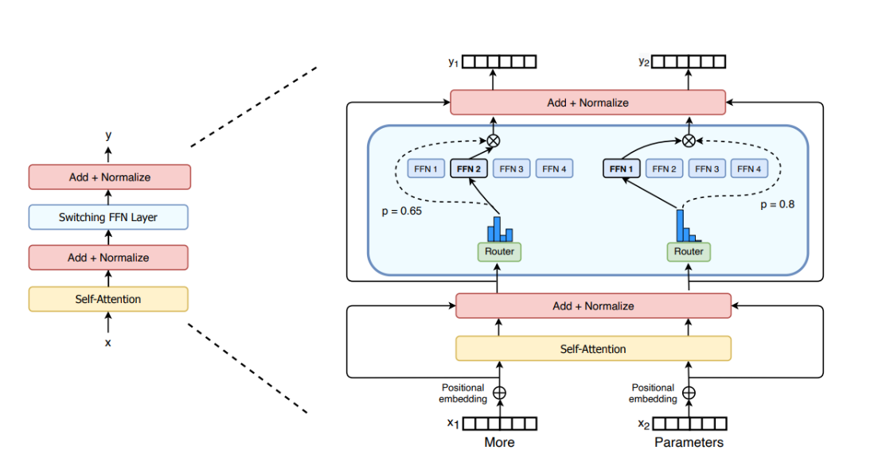
</p>

Swtich Transformers中将FFN替换为了MoE结构。

在 Transformer 架构中，MoE 通常用来替换标准的 **FFN (Feed-Forward Network)** 层。

1.  **专家层 (Experts)**：由一组独立的简单前馈神经网络（MLP）组成（例如 $E_1, E_2, ..., E_n$）。
2.  **门控网络 (Gating Network / Router)**：一个可训练的线性层+Softmax，用于计算每个专家对当前 token 的匹配权重。
3.  **稀疏激活 (Sparse Gating/Top-k)**：
    *   输入 $x$ 进入 Router，计算所有专家的分数。
    *   **Top-k**：只选取分数最高的 $k$ 个专家（通常 $k=1$ 或 $2$），其余专家的输出置为 0（不进行计算）。
    *   **输出聚合**：将选中的专家输出按 Router 的权重进行加权求和。
$$ y = \sum_{i \in TopK} G(x)_i \cdot E_i(x) $$

### 负载均衡(Load Balancing)
在 MoE 模型中，由于每个 token 只激活部分专家，容易导致某些专家被频繁选中，而其他专家则很少被使用，造成“专家过载”或“专家闲置”的问题。为了缓解这一问题，通常会在训练过程中引入负载均衡（Load Balancing）机制，鼓励模型均匀地利用所有专家，从而提升整体性能和泛化能力。

通常会引入辅助损失函数（Auxiliary Loss）来强制让分配尽量均匀。DeepSeek-V3 通过共享专家与容量约束(capacity factor)等机制控制路由均衡，因此并未额外引入Switch Transformer式的auxiliary loss。

### 共享专家(Shared Experts)

在一些 MoE 变体中，不同层或不同模块之间会共享同一组专家网络（Experts），以减少模型的总参数量，同时保持模型的表达能力。这种“共享专家”机制使得模型能够在不同的上下文中复用相同的专家，从而提升参数利用率和训练效率。如DeepSeek-V3 (670B A37B)的expects总数为256+1，top-k数量为8+1，Qwen3-235B-A22B则分别为128与8。

### MoE的代码实现结构示意

```python
import torch
import torch.nn.functional as F

def moe_forward(x, gate_weight, experts, k=2):
    # x: [batch_size, seq_len, hidden_dim]

    # 1. 计算路由得分 (Logits)
    router_logits = torch.matmul(x, gate_weight) # [batch, seq, num_experts]

    # 2. Top-K 选择
    # routing_weights: 选中的专家的原始分数 (或经过 softmax 后的概率)
    # selected_experts: 选中的专家索引
    routing_weights, selected_experts = torch.topk(router_logits, k, dim=-1)

    # 3. 归一化 (通常在 TopK 之后做 Softmax)
    routing_weights = F.softmax(routing_weights, dim=-1)

    # 4. 专家计算 (这里简化了并行计算的复杂性)
    # 实际工程中会使用 Permutation 或 Scatter/Gather 操作
    final_output = torch.zeros_like(x)
    for i in range(k):
        expert_idx = selected_experts[:, :, i]
        weight = routing_weights[:, :, i].unsqueeze(-1)

        # 伪代码：取出对应专家计算并加权
        # expert_out = run_expert(experts, expert_idx, x)
        # final_output += weight * expert_out

    return final_output
```

## LoRA

LoRA (Low-Rank Adaptation) 是一种**参数高效微调 (PEFT, Parameter-Efficient Fine-Tuning)** 技术。简单来说，在base model（处于预训练状态的模型，其训练样本为整个互联网）的基础上针对特定样本进行训练与微调。

**核心思想**：大模型虽然参数巨大，但在适应特定任务时，其权重矩阵的改变量（$\Delta W$）其实具有很低的“内在秩”（Low Intrinsic Rank）。也就是说，我们不需要调整所有的参数，只需要在一个低维空间中优化，就能达到类似全量微调的效果。

LoRA 并不直接更新预训练模型的权重 $W$，而是在这旁路学习两个低秩（low rank）矩阵 $A$ 和 $B$。

### 数学原理
假设预训练权重矩阵为 $W_0 \in \mathbb{R}^{d \times k}$，微调后的权重为 $W_0 + \alpha \Delta W$，其中$\alpha$为scaling factor。

LoRA 将 $\Delta W$ 分解为两个矩阵的乘积：
$$ \Delta W = B A $$
其中：
*   $B \in \mathbb{R}^{d \times r}$
*   $A \in \mathbb{R}^{r \times k}$
*   $r \ll \min(d, k)$（$r$ 是秩，通常很小，如 8, 16, 64）

### 初始化策略
为了保证训练开始时，模型等价于原始预训练模型（即 $\Delta W = 0$）：
*   矩阵 $A$ 使用高斯分布初始化（Random Gaussian）。
*   矩阵 $B$ 初始化为全 0（Zeros）。
这样初始状态 $BA=0$。

### LoRA的优点

1.  **极大降低显存占用**：我们锁定了主模型参数 $W_0$（不需要算梯度），只训练 $A$ 和 $B$（参数量通常不到原模型的 1%）。
2.  **便于存储与分享**：只需要保存几 MB 的 LoRA 权重，而不是几百 GB 的大模型文件。
3.  **推理无延迟（Zero Latency）**：在推理阶段，可以将 $BA$ 预先加回到 $W_0$ 中（Merge操作），即 $W_{new} = W_0 + BA$，这样推理架构与原模型完全一致，不增加任何计算耗时。
4.  **快速切换**：针对不同任务训练即使不同的 LoRA，使用时只需动态替换 Adapter 即可。

### LoRA代码实现结构示意

```python
import torch
import torch.nn as nn

class LoRALayer(nn.Module):
    def __init__(self, in_dim, out_dim, rank, alpha):
        super().__init__()
        std_dev = 1 / torch.sqrt(torch.tensor(rank).float())
        self.A = nn.Parameter(torch.randn(in_dim, rank) * std_dev)
        self.B = nn.Parameter(torch.zeros(rank, out_dim))
        self.alpha = alpha

    def forward(self, x):
        x = self.alpha * (x @ self.A @ self.B)
        return x
```

### HuggingFace中的LoRA

HuggingFace中提供了“PEFT”（Parameter-Efficient Fine-Tuning，参数高效微调库，用于高效地微调大型预训练模型。

LoRA是建立在一个已有的base model之上的，LoRA中的参数是base model的参数的一部分。

```python
import transformers
from peft import get_peft_model, LoraConfig, TaskType

model_id = ''
llama = transformers.LlamaForCausalLM.from_pretrained(model_id)

peft_config = LoraConfig(task_type=TaskType.CAUSAL_LM, 
    inference_mode=False, r=8, lora_alpha=32, lora_dropout=0.1)

peft_model = get_peft_model(llama, peft_config)
```

#### PEFT的PeftModelForCausalLM结构

```python
PeftModelForCausalLM(
  (base_model): LoraModel(
    (model): LlamaForCausalLM(
      (model): LlamaModel(
        (embed_tokens): Embedding(128256, 4096)
        (layers): ModuleList(
          (0-31): 32 x LlamaDecoderLayer(
            (self_attn): LlamaSdpaAttention(
              (q_proj): lora.Linear(
                (base_layer): Linear(in_features=4096, out_features=4096, bias=False)
                (lora_dropout): ModuleDict(
                  (default): Dropout(p=0.1, inplace=False)
                )
                (lora_A): ModuleDict(
                  (default): Linear(in_features=4096, out_features=8, bias=False)
                )
                (lora_B): ModuleDict(
                  (default): Linear(in_features=8, out_features=4096, bias=False)
                )
```

## 数的精度与模型量化

# 大语言模型训练

## 数据集

数据集有其自身格式，一般地，包含'train', 'validation', 'test'部分，通过`load_dataset`函数加载后可以获取数据集字典。数据集可以从存储在本地文件或远程文件加载，以 csv、json、txt 或 parquet 文件的形式存储。

```python
from datasets import load_dataset

ds = load_dataset("yahma/alpaca-cleaned")
print(ds)
ds_train = ds["train"]
print(ds_train)
```

```python
def tokenize_function(dataset):
    ...
    return ...

ds = load_dataset("yahma/alpaca-cleaned", split='train[:100]')
ds = ds.map(tokenize_function, batched=True)
```

数据集划分：train/validation/test数据集

## LLM封装和参数装载

```python
import torch
from torch import Tensor
from torch.nn import Module, Parameter  
import torch.nn.init as init
import torch.nn.functional as F
import math

class MyNetwork(Module):
    def __init__(self):
        super(MyNetwork, self).__init__()
        self.conv1 = torch.nn.Conv2d(3, 6, 5)
        self.pool = torch.nn.MaxPool2d(2, 2)
        self.conv2 = torch.nn.Conv2d(6, 16, 5)
        self.fc1 = torch.nn.Linear(16 * 5 * 5, 120)
    def forward(self, x):
        x = self.pool(torch.relu(self.conv1(x)))
        x = self.pool(torch.relu(self.conv2(x)))
        x = x.view(-1, 16 * 5 * 5)
        x = torch.relu(self.fc1(x))
        return x
    
model = MyNetwork()
```

### nn.linear

`nn.linear`是LLM的核心模块。

```python
class Linear(Module):
    __constants__ = ["in_features", "out_features"]
    in_features: int
    out_features: int
    weight: Tensor

    def __init__(
        self, in_features: int, out_features: int, bias: bool = True, device=None, dtype=None,) -> None:
        factory_kwargs = {"device": device, "dtype": dtype}
        super().__init__()
        self.in_features = in_features
        self.out_features = out_features
        # Parameter()初始化会自动注册到model.parameters()中，并使用reset_parameters方法进行初始化weight
        self.weight = Parameter(
            torch.empty((out_features, in_features), **factory_kwargs)
        )
        if bias:
            self.bias = Parameter(torch.empty(out_features, **factory_kwargs))
        else:
            self.register_parameter("bias", None)
        self.reset_parameters()

    # reset_parameters方法，进行初始化
    def reset_parameters(self) -> None:
        # Setting a=sqrt(5) in kaiming_uniform is the same as initializing with
        # uniform(-1/sqrt(in_features), 1/sqrt(in_features)). For details, see
        # https://github.com/pytorch/pytorch/issues/57109
        init.kaiming_uniform_(self.weight, a=math.sqrt(5))
        if self.bias is not None:
            fan_in, _ = init._calculate_fan_in_and_fan_out(self.weight)
            bound = 1 / math.sqrt(fan_in) if fan_in > 0 else 0
            init.uniform_(self.bias, -bound, bound)

    # forward方法，进行前向传播
    def forward(self, input: Tensor) -> Tensor:
        return F.linear(input, self.weight, self.bias)
```

### Model的存储和装载

使用`print(model)`查看model中的内容

```python
print(model)
print(model.state_dict())
```

使用`torch.save("model_weights.pt")`将模型存储为`.pt`文件至磁盘，该情况针对模型参数；也可以直接存储模型结构+模型参数

```python
torch.save(model.state_dict(), "model_weights.pt")
torch.save(model, "model.pt")
```

使用`torch.load`加载模型

```python
model.load_state_dict(torch.load('model_weights.pt', weights_only=True))
model.load_state_dict(torch.load('model.pt', weights_only=False))
```

### 流程概览

1. 从公开数据集中载入
2. 规则过滤并清洗文本
3. 统一字段/模板便于拼接
4. 拆分训练与验证集
5. Tokenizer对齐

#### 1.从公开数据集中载入（以Alpaca为例）

```python
from datasets import load_dataset

# 直接使用HF镜像
raw_ds = load_dataset("tatsu-lab/alpaca")
train_raw = raw_ds["train"]
```

Alpaca只有train dataset，没有validation和test dataset，并且需要手动拆分。

#### 2.规则过滤并清洗文本

数据准备：从语料到可训练样本

* 数据来源：开源语料、业务日志、合成数据
* 质量控制：清洗噪声、去重复、敏感信息脱敏
* 样本结构：明确字段（instruction/input/output/messages）
* 划分策略：train/validation/test避免数据泄漏
* Tokenizer对齐：确保训练与推理共享词表及预处理

```python
# 过滤示例：只保留output中长度大于5的部分
def keep_example(example):
    answer = example["output"].strip()
    return len(answer) > 5

filtered = train_raw.filter(keep_example) # 自动并行处理，返回过滤后的数据集
```

#### 3.统一字段/模板便于拼接

以Alpaca数据集为例，其结构包含'instruction', 'input', 'output'，'text'，如图所示：

<p align="center">
  
  </p>

```python
def build_messages(example):
    user_prompt = example["instruction"].strip() # strip()去除开头与结尾的空格
    if example["input"]:
        user_prompt += "\n" + example["input"].strip() # 若有input，则拼接到instruction后面
    return {
        "messages": [
            {"role": "user", "content": user_prompt},
            {"role": "assistant", "content": example["output"].strip()},
        ] # 返回message字典，role区分用户和助手，content为具体内容
    }
structured = filtered.map(build_messages)
# map函数会将build_messages函数应用到数据集的每个样本上，返回新的数据集
```

#### 4.划分训练/验证
```python
split_data = structured.train_test_split(test_size=0.02, seed=42)
train_data = split_data["train"]
val_data = split_data["test"]

# 按任务标签分层
train_test_split(..., stratify_by_column="category")
```

按长度分桶，先增加分桶字段，再使用`stratify_by_column`保持长短样本分布一致
```python
def add_length_bucket(example):
    length = len(example["messages"][0]["content"].split())
    bucket = min(length // 200, 4)  # 0-4 共5档
    example["len_bucket"] = bucket
    return example
bucketed = structured.map(add_length_bucket)
split_bucketed = bucketed.train_test_split(
    test_size=0.02,
    seed=42,
    stratify_by_column="len_bucket",
)
```
labels具体是指什么？train set 和 test set

对dateset进行结构上的处理：strip()、map() 

label的作用，对于某个样本任何tokn都可以作为input，将其后续的部分作为output训练

collate()函数做批量补全padding

## Megatron中运用的并行化技术

Megatron 作为 NVIDIA 提出的高性能大规模模型训练框架，巧妙地结合了多种并行化技术：

+ 张量并行（Tensor Parallelism）：将模型中的大型权重张量沿特定维度切分，在不同 GPU 上分别计算，最后汇总
+ 数据并行（Data Parallelism）：将数据集划分成多个子集，每个子集交给一个模型副本进行计算，最后同步参数；
+ 流水线并行（Pipeline Parallelism）：模型划分为多个连续的阶段；
+ 序列并行（Sequence Parallelism）：将长序列输入划分并在多个 GPU 上并行处理，虽然可以缓解激活值占用显存的问题，但会导致模型的其他参数需要复制到所有模型副本中，因此不适用于大型模型的训练。

### TP

#### TP on MLP

回忆MLP中tensor的升维与降维操作：

$$[\dots, 𝐻]∗[𝐻, 4𝐻]=[\dots, 4𝐻]$$
$$[\dots, 4𝐻]∗[4𝐻, 𝐻]=[\dots, 𝐻]$$

需要作并行化处理的正是权重矩阵 $𝐴:[𝐻, 4𝐻]$, $𝐵:[4𝐻, 𝐻]$

+ 对矩阵 $𝐴$ 及后续 $𝐺𝑒𝐿𝑈$ 作切分：
  将 $𝐴$ 沿着列方向切分为 $𝐴=[𝐴_1,𝐴_2]$，于是有：$[𝑌_1,𝑌_2 ]=[𝐺𝑒𝐿𝑈(𝑋𝐴_1 ), 𝐺𝑒𝐿𝑈(𝑋𝐴_2 )]$

+ 对矩阵 $𝐵$ 作切分：
  由于前一步的切分导致中间结果 $𝑌$ 也被沿着列方向切开，因此在这一步中需要将 $𝐵$ 沿行方向切开，即 $𝐵=[𝐵_1;𝐵_2]$，于是有：$YB=[𝑌_1,𝑌_2 ][𝐵_1;𝐵_2]=[𝑌_1 𝐵_1+𝑌_2 𝐵_2]$

<p align="center">
  
</p>

+ 需要在输入时复制 $𝑋$ ，并在输出前合并 $𝑌𝐵$ 的计算结果
+ 分别引入了两个共轭的操作 $𝑓$ 和 $𝑔$；
  + $𝑓$ 在前向传播时复制 $𝑋$，在反向传播时通过 `all-reduce` 合并计算结果；
  + $𝑔$ 与之相反。

All-reduce操作(对比broadcast操作)：

<p align="center">
  
</p>

#### TP on Attention

对 Self-Attention 部分的并行化设计利用了 Multihead Attention 本身的并行性，从列方向切分权重矩阵，并保持了与每个头的对应:

+ 在每个头中，仍然保持了原本的计算逻辑，即：$O=𝐷𝑟𝑜𝑝𝑜𝑢𝑡(𝑆𝑜𝑓𝑡𝑚𝑎𝑥(\frac{𝑄𝐾^𝑇}{\sqrt{𝑑}}))𝑉$ 
+ 并行化后的中间结果为 $𝑌=[𝑌_1, 𝑌_2 ]$；

Dropout 的部分和之前 MLP 部分基本一致，将权重矩阵 $𝐵$ 沿行方向切开，因此同样需要在 Dropout 之前将 $𝑌_1 𝐵_1,𝑌_2 𝐵_2$ 合并；

总体来看，对 Attention 部分的并行化操作仍然需要在首尾分别添加 $𝑓$, $𝑔$ 。

### PP

#### Default pipeline in GPipe

流水线并行（Pipeline Parallelism）：[GPipe](https://arxiv.org/pdf/1811.06965)将模型划分为多个连续的阶段，每个阶段包含若干的层，再把这些阶段分配到不同的 GPU 上，使得各个 GPU 能在时间上错开地处理不同的数据。

存在问题：

  * Bubble time size：流水线会在一个批次全部计算完成后统一更新权重，灰色区域就是 GPU 需要等待的时间，比例约为 $\frac{𝑝 − 1}{𝑚}$
  * Memory：反向传播完成前需保存所有微批次在前向中的激活值

<p align="center">
  
</p>

#### 1F1B in PipeDream-Flush

[PipeDream-Flush](https://arxiv.org/pdf/2006.09503) 把一个迭代分成三个阶段:

* 预热前向传播阶段：每个 worker 会做前向计算，并且向其下游发送激活，一直到最后一个 stage 被激发。该调度将执行中的微批次数量限制在流水线深度之内，而不是一个批次中的微批次数量；
* 稳定 1F1B 阶段：进入稳定状态之后，每个 worker 都进行1F1B 操作。
* 冷却反向传播阶段：此阶段会把执行中的的微批次执行完毕，只执行反向计算和向反向计算下游发送梯度。

尽管 PipeDream-Flush 与 GPipe 的 bubble time size 相同，但是由于 PipeDream-Flush 限制了执行中的微批次数量，因此相较于 GPipe，更加节省显存：

* Bubble time size: $\frac{𝑝 − 1}{𝑚}$；
* PipeDream-Flush 中最大执行微批次数量 $𝑝$；
* GPipe 中最大执行微批次数量 $𝑚$；

<p align="center">
  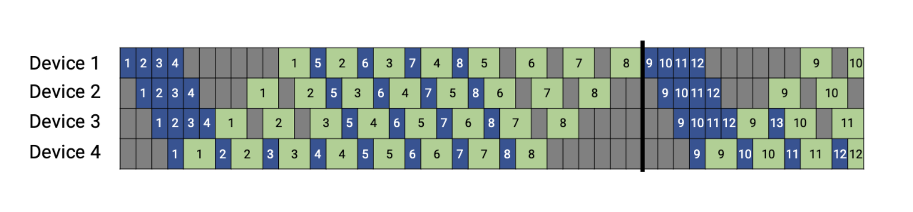
</p>

####  PP in Megatron

通过划分更细粒度的阶段，将 bubble time size 降低到了 $\frac{1}{𝑣} \times \frac{𝑝 − 1}{𝑚}$；需要付出更多的通信代价。

以 MLP 部分的 TP 为例：在 $𝑔$ 之前的 $𝑍_1,𝑍_2$ 分布在两个 GPU 上，经过 $𝑔$ 合并之后，每个 GPU 上的输出 $𝑍$ 是相同的，由此导致相邻的两个流水线阶段发送和接收的数据是重复的；因此，可以将输出 $𝑍$ 划分为多个相同大小的部分，每个 GPU 只将自己保存的部分发送给对应的 GPU，再在下一个阶段中合并，得到完整的数据。

<p align="center">
  
</p>

### TP+SP

基于 LayerNorm 和 Dropout 是与序列顺序无关的(激活值过多的元凶其实是过大的$s$)，因此对这两部分采用序列并行，从 $𝑠𝑒𝑞𝑢𝑒𝑛𝑐𝑒$ 维度切分，从而减少了激活值占用的显存；由此带来新的共轭通信操作 $𝑔$, $\bar{𝑔}$。

$𝑔$ 在前向传播时作 `all-gather`，反向传播时作 `reduce-scatter`； $\bar{𝑔}$ 与之相反。

<p align="center">
  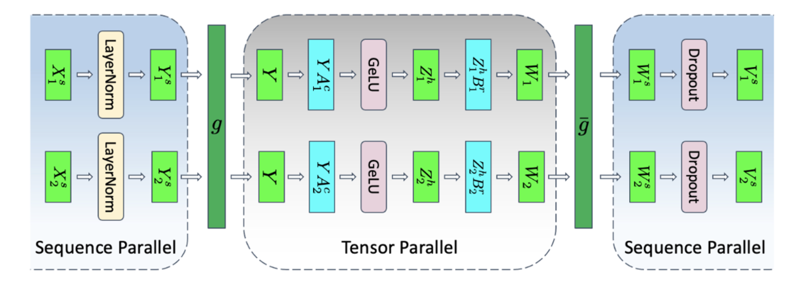
</p>

<p align="center">
  
</p>

# 大语言模型推理

在经过训练过后的大模型中，所有的权重矩阵、LayerNorm参数、Embedding表等都已经确定下来，模型可以根据输入的文本进行推理(inference)，即根据输入的文本生成相应的输出文本。

<p align="center">
  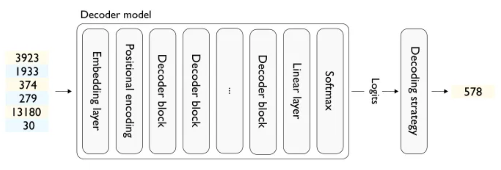
</p>

模型推理到最后输出的是logits（通过softmax得到token的概率分布），要得到token，还需通过decoding strategy（解码策略）将logits转换为token id，再通过tokenizer转换为文本。

## LLM的解码(decoding)

### 不同的解码策略

#### 贪心解码(Greedy Decoding)

每次直接选择概率最高的token，简单高效，但并非全局最优，相当于Top-k中的k=1。

#### 采样(Sampling)

按一定的采样策略选择一个单词，增加生成过程的多样性，但可能会导致生成的文本不连贯。

#### Beam Search

通过维护一个长度为k的候选序列集，每一步(单token推理)从每个候选序列的概率分布中选择概率最高的k个token，再考虑序列概率，保留最高的k个候选序列（避免随推理过程增加所关注序列的数量呈指数级增长）。

#### top-p采样

核心思路：给定token分布$P(x_i\mid x_{1:i-1})$，top-p集合$V^{(p)}\subset V$，使得$\sum_{x\in V^{(p)}}P(x\mid x_{1:i-1})\geq p$，从$V^{(p)}$中采样。和top-k很像，区别在于在何处对分布进行截断（top-k可以理解为固定截断点，top-p是动态截断点）。

### Temperature

logits本质是未归一化的偏好；模型常常过度自信→输出缺少多样性；只靠top-k/top-p截断无法改变分布“尖锐程度”，难以在“稳定 vs 创造力”之间细调。

Temperature提供一个连续控制杆：既可降低幻觉/重复，也可放开想象力（创造vs稳定，类似基于高斯过程的贝叶斯优化中的exploration和exploitation的区别），因此在实践中常把temperature视为“首个要调”的超参数。

配合beam采样和top-p使用，调整temperature值来控制采样的随机性。

数学形式：

$$\tilde{p}_i = \text{softmax}(z_i / T),T>0$$
  * $T<1$：放大logits差异，分布更“尖锐”，输出更确定
  * $T>1$：压平logits，概率更平均，输出更随机
* 实践经验
  * 0.1-0.5：摘要/QA等需要确定性的任务
  * 0.7-1.3：创作/头脑风暴
  * $T\rightarrow 0$: 接近贪婪解码；$T\rightarrow \infty$: 接近均匀采样

### Penalty

* 纯靠temperature/top-k/top-p仍可能出现短循环、口头禅、提示词泄露等模式崩溃
* 不同任务对“重复”和“长度”容忍度不同，需要有针对性的约束手段
* Penalty机制通过修改logits或得分，打破模型对高频token的偏好，提升可控性
* 有的为“软惩罚”(repetition/presence)，有的为“硬约束”(no_repeat_ngram)，可组合使用

#### 常见Penalty机制

* repetition penalty (HF实现):对生成过的token乘以$1/\text{penalty}$或$\text{penalty}$，惩罚重复；>1.0时抑制循环
* presence / frequency penalty (OpenAI)
  * presence：是否出现过→每次出现扣常数
  * frequency：出现次数越多扣得越多→抑制关键词刷屏
* length penalty (Beam Search)
  * 调整对长序列的偏好，$\text{score}/((5+|y|)^\alpha / (5+1)^\alpha)$

## LLM推理的两大阶段

### NTP(Next Token Prediction)

基于LLM自回归生成(autoregressive generation)的特点如下：

逐token生成，生成的token依赖于前面的token（生成i个token后，将1~i个token作为上下文继续生成第i+1个token）；

一次只能生成一个token，无法同时生成多个token（Deepseek v3引入了MTP的机制，主要是应用在训练过程中）。

### Prefill Phase

当用户向大模型发送一段 Prompt时，模型首先需要“阅读”并理解这段完整的输入。这一步称为 Prefill Phase（预填充阶段）。在这个阶段，模型会将整个 Prompt 作为输入，一次性处理完毕，生成对应的隐藏状态（hidden states）和注意力缓存（Key/Value caches）。

在NTP过程中，模型需要不断地处理和存储历史上下文信息（Key/Value缓存），以便在生成下一个token时参考之前的内容。随着生成的token数量增加，Key/Value缓存的大小也会线性增长，导致显存占用和计算开销显著增加。而通过Prefill Phase，模型可以一次性处理完整的Prompt，提前计算并存储必要的上下文信息，从而在后续的token生成过程中减少重复计算，提高推理效率。

### Decoding Phase

当第一个"下一个token"生成完毕后，LLM开始"自回归推理"生成。

第二个"下一个token"：输入x的shape: $(b,s+1,h)$，计算开销$O((s+1)^2)$

第三个"下一个token"：输入x的shape: $(b,s+2,h)$，计算开销$O((s+2)^2)$

第n个"下一个token"：输入x的shape: $(b,s+n-1,h)$，计算开销$O((s+n-1)^2)$

然而，通过KV Cache机制，可以避免重复计算历史Token的K和V，从而将每一步的计算开销降低到$O(n)$级别。

## KV Cache

考虑一次LLM推理过程中的计算开销，先进行一下符号的规定：
  * b: batch size
  * s: sequence length
  * h: hidden size/dimension
  * nh: number of heads
  * hd: head dimension

给定矩阵$A\in R^{m\times n}$和矩阵$B\in R^{n\times p}$，计算$AB$中的一个元素需要$n$次乘法操作和$n$次加法操作，一共有$mp$个元素，总计算开销为$2mnp$ 。

**Self-attn模块：**

第一步计算: $Q=xW_q$, $K=xW_k$, $V=xW_v$
  * 输入x的shape: $(b,s,h)$，weight的shape: $(h,h)$
  * Shape视角下的计算过程: $(b,s,h)(h,h)\rightarrow(b,s,h)$
  * 如果在此进行多头拆分(reshape/view/einops)，shape变为$(b,s,nh,hd)$，其中$h=bh*hd$
  * 计算开销: $3\times 2bsh^2\rightarrow 6bsh^2$

第二步计算: $O=\text{softmax}(\frac{QK^T}{\sqrt{h}})V$
  * $QK^T$计算: $(b,nh,s,hd)(b,nh,hd,s)\rightarrow (b,nh,s,s)$
  * 计算开销: $2b*nh*s^2*hd=2bs^2h$ (为理解方便，暂且忽略softmax的计算开销)
  * $\text{softmax}(\frac{QK^T}{\sqrt{h}})V$计算: $(b,nh,s,s)(b,bh,s,hd)\rightarrow(b,nh,s,hd)$
  * 计算开销: $2bs^2h$
  * 总计算开销: $4bs^2h$

第三步计算：$x_{\text{out}}= O W_o + x$
  * $O$的shape为$(b,s,h)$，$W_o$的shape为$(h,h)$，计算过程为$(b,s,h)(h,h)\rightarrow(b,s,h)$
  * 计算开销: $2bsh^2$
  
Self-attn模块总计算开销: $8bsh^2+4bs^2h$

**MLP模块：**

$x=f_\text{activation}(x_{\text{out}}W_{\text{up}})W_{\text{down}}+x_{\text{out}}$
第一步计算，假设上采样到4倍
  * Shape变化:$(b,s,h)(h,4h)\rightarrow(b,s,4h)$
  * 计算开销: $8bsh^2$

第二步计算，假设下采样回1倍
  * Shape变化:$(b,s,4h)(4h,h)\rightarrow(b,s,h)$
  * 计算开销: $8bsh^2$
 
MLP模块总计算开销: $16bsh^2$

Decoder layer一次推理的总开销：$24bsh^2+4bs^2h$，为$s$的平方级别（$b\ll s$，且h在模型确定后为固定值）。

考虑s和s+1的两种情况下的$QK^T$

每次

视频的直观展示：

without KV Cache:
<video src="resources/Without KV Cache.mp4" controls="controls" width="100%" height="auto">
</video>

with KV Cache:

<video src="resources/KV Cache.mp4" controls="controls" width="100%" height="auto">

</video>

所以，真正自回归计算的部分是$(b,s+1,h)$中的第二个维度$index_{s+1}$的部分，复用的是用于计算$(b,s+1,h)$中第二维度$index_{s+1}$的数值，从shape的视角: $(b,s+1,h)\rightarrow (b,1,h)$

### 为什么只有K和V需要缓存

整个self-attn计算过程中，只有$QK^T$中的$K$和$\text{softmax}(\frac{QK^T}{\sqrt(h)})V$中的$V$需要复用，而Q依赖当前token的Embedding，必须实时计算；Attn输出和MLP输出也会被LayerNorm/残差更新，无法直接重用。
### KV Cache的内存消耗

对于批大小 $b$，层数 $l$，头数 $h$，序列长度 $s$，头维度 $d$：
  $$
  \text{KV\_memory} \approx b \times l \times h \times s \times d \times 2 \times \text{dtype\_size}
  $$

dtype 通常为 FP16/BF16；缓存越大，显存消耗越高，存储和计算均为$O(s)$级别的开销。

## Sparse Attention

虽然 KV Cache 避免了重复计算，但随着序列变长，Cache 的内存占用和 Attention 的计算量仍呈线性（甚至平方，取决于具体实现）增长。**Sparse Attention** 的核心思想是：**并非所有的 token 都需要关注之前所有的 token**。很多时候，局部上下文或特定的关键信息就足够了。

通过只让 Token 关注一部分历史信息（即让 Attention Matrix 变得稀疏），可以将计算复杂度从 $O(N^2)$ 降低到 $O(N \log N)$ 甚至 $O(N)$。

### Attention的稀疏性

在 Self-Attention 计算过程中发现，注意力矩阵中，大部分权重接近0，且整体表现出如下几种现象。

<p align="center">
  
</p>

### Sparse Attention的几种实现方式

#### static pattern

1. Sliding windows: 维护一个固定大小(k)的窗口，保留最近的 tokens 参与计算，其余全部丢弃。

<p align="center">
  
</p>

优点是实现简单，计算复杂度降低到 $O(k)$；缺点是精度损失较大，尤其是在长度超过预训练长度后大幅下降。

2. Attention sinks(StreamingLLM): 

[StreamingLLM](https://arxiv.org/abs/2309.17453) 发现注意力权重往往会集中在首 token 上，将这一现象称为 attention sinks。基于该发现，StreamingLLM 在 sliding window 的基础上进一步保留 attention sinks，降低了长文本场景下稀疏导致的精度损失。

<p align="center">
  
</p>

#### dynamic pattern

1. [MInference](https://arxiv.org/abs/2407.02490) 通过观察注意力矩阵，总结出三种常见模式，根据输入动态选择最合适的模式，从而加速 prefill 阶段。

2. [Quest](https://arxiv.org/abs/2406.10774) 采用分页设计，估计每个 KV page 与当前 Q 的相似度，动态选择最相似（激活值最高）的 pages 参与计算。

对比static pattern：

优点是相较于 static pattern，dynamic pattern 类的方法精度更高；

缺点是由于计算最合适的 tokens 会引入一定 overhead，综合下来会比简单的 static pattern 方法慢（但是相比 dense attention 还是有加速效果）;同时，如何设计选择算法也依赖经验（启发式）。

## Paged Attention

**PagedAttention** 是高吞吐量推理框架 [vLLM](https://github.com/vllm-project/vllm) 的核心技术。针对标准 KV Cache 显存利用率低的问题，它借鉴了操作系统中**虚拟内存（Virtual Memory）**和**分页（Paging）**的管理思想。

### 标准 KV Cache 的显存浪费

在传统的实现中（如 HuggingFace Transformers），KV Cache 通常存储在连续的显存空间中。由于 LLM 生成的长度通常是未知的，为了防止溢出，系统往往需要预分配最大可能长度（max_seq_len）的连续内存。这就导致了两种严重的显存浪费：

*   **内部碎片（Internal Fragmentation）**：预分配了很长的空间，但实际生成的序列很短，多余的空间无法被利用。
*   **外部碎片（External Fragmentation）**：显存中分散着许多小的空闲块，但由于不连续，无法分配给需要大块连续内存的新请求。

据统计，在传统系统中，显存的浪费率可能高达 **60% - 80%**。

### 核心思想

PagedAttention 允许 KV Cache 在显存中**非连续**存储。它将每个序列的 KV Cache 切分成固定大小的块（**KV Block**），类似于 OS 中的 Page。

*   **Logical Blocks（逻辑块）**：从请求的角度看，token 是连续的。
*   **Physical Blocks（物理块）**：从显存的角度看，数据存储在非连续的物理地址中。
*   **Block Table（页表）**：维护逻辑块到物理块的映射关系。

### 实现细节

假设 Block Size = 4（每个块存 4 个 token 的 KV）：

1.  **分配（Allocation）**：
    *   当一个新的 token 生成时，如果当前最后的物理块未满，直接写入。
    *   如果已满，调度器从全局的物理块池中申请一个新的物理块（地址可以是任意位置），并在 Block Table 中记录映射。

2.  **注意力计算（Attention Calculation）**：
    *   PagedAttention 编写了定制的 CUDA Kernel。
    *   在计算 Attention Score 时，Kernel 不再假设 KV 是连续的，而是根据 Block Table 动态地去显存的不同位置抓取数据块进行计算。

3.  **内存共享（Memory Sharing）**：
    *   这是 PagedAttention 最大的优势之一。类似于 OS 的写时复制（Copy-on-Write），多个请求可以共享相同的物理块。
    *   **应用场景**：
        *   **Parallel Sampling**：同一个 Prompt 生成多种不同的输出。Prompt 部分的 KV Cache 只需要存储一份。
        *   **Beam Search**：多个 Beam 共享公共的前缀历史。

### 代码逻辑示意

虽然底层的 PagedAttention 是用 CUDA 实现的，但其 Python 端的调度逻辑大致如下：

```python
class BlockTable:
    def __init__(self):
        self.logical_to_physical = [] # 存储物理块的ID

def allocate_block(physical_block_pool):
    # 从空闲池中取出一个物理块ID
    return physical_block_pool.pop()

# 随着推理进行，动态分配显存
current_token_index = 10
block_size = 4

if current_token_index % block_size == 0:
    # 需要分配新块
    new_physical_id = allocate_block(pool)
    sequence.block_table.append(new_physical_id)
    
# 将KV写入对应的物理地址
physical_address = map_to_address(new_physical_id)
write_kv(physical_address, k, v)
```
## Linear Attention

标准 Self-Attention 的核心瓶颈在于其 $O(N^2)$ 的时间和空间复杂度。**Linear Attention (线性注意力)** 旨在通过改变计算顺序或近似 Kernel 函数，将复杂度降低到 $O(N)$。

回顾标准 Attention 公式：
$$ \text{Attention}(Q, K, V) = \text{softmax}\left(\frac{QK^T}{\sqrt{d_k}}\right)V $$

这里必须先计算 $QK^T$，得到一个 $N \times N$ 的矩阵（Attention Map），然后再乘以 $V$。正是这个 $N \times N$ 矩阵导致了平方级复杂度。

### 核心思想

核心思想是结合律与 Kernel Trick。如果能去掉 Softmax，或者将 Softmax 进行某种分解，我们就可以利用矩阵乘法的**结合律 (Associativity)**。

假设我们可以找到一个映射 $\phi(\cdot)$ 使得 $\text{sim}(Q, K) \approx \phi(Q) \phi(K)^T$，那么：

$$ \text{Attention}(Q, K, V) \approx \left( \phi(Q) \phi(K)^T \right) V $$

利用结合律，我们改变计算顺序：

$$ \phi(Q) \left( \phi(K)^T V \right) $$

*   **传统做法**：$(Q K^T) V$
    *   $Q K^T$: $(N \times d) \times (d \times N) \rightarrow (N \times N)$
    *   Result $\times V$: $(N \times N) \times (N \times d) \rightarrow (N \times d)$
    *   **复杂度**: $O(N^2)$

*   **Linear Attention**：$Q (K^T V)$
    *   $K^T V$: $(d \times N) \times (N \times d) \rightarrow (d \times d)$
    *   $Q \times$ Result: $(N \times d) \times (d \times d) \rightarrow (N \times d)$
    *   **复杂度**: $O(N d^2)$

由于通常 sequence length $N$ 远大于 hidden dimension $d$，因此 $O(N)$ 远优于 $O(N^2)$。

### Efficient Attention / Performer

难点在于如何处理 Softmax 这种非线性操作。

**Efficient Attention**: 去掉 Softmax，改为分别对 $Q$ 和 $K^T$ 做 Row-wise / Col-wise 的归一化，使得它们可以直接相乘。
    $$ \text{Attention}(Q,K,V) = \rho_q(Q) (\rho_k(K)^T V) $$
**Performer**: 使用随机正交特征 (Random Orthogonal Features) 来近似 Softmax 核函数。

优缺点对比：

*   **优点**：
    *   推理速度快，显存占用极低，特别是对于超长文本。
    *   实现了真正的 $O(N)$ 复杂度。
*   **缺点**：
    *   **精度损失**：由于是对 Softmax 的近似或替换，往往无法完全达到标准 Attention 的表现。
    *   **训练不稳定**：部分 Kernel Trick 方法在训练时不如标准 Attention 稳定。

因此，目前主流 LLM (如 Llama, GPT) 依然坚持使用标准 Attention (配合 FlashAttention 优化)，而 Linear Attention 更多用于特定的长序列任务或作为架构创新的组件 (如 RWKV, Mamba 等其实在思想上与 Linear Attention 有异曲同工之妙——即 RNN 形式的推理)。

## Gated Attention

标准 Transformer 结构通常由 **Multi-Head Attention (MHA)** 和 **Feed-Forward Network (FFN)** 两个独立的子层叠堆而成。**Gated Attention** 的核心思路是引入门控机制（Gated Mechanism，类似于 LSTM 中的门或 GLU），用来更精细地控制信息的流动，或者将 Attention 与 FFN 的功能进行融合。

### Gated Attention Unit (GAU)
GAU 是在论文 [Transformer Quality in Linear Time](https://arxiv.org/abs/2202.10447) (FLASH) 中提出的结构。
*   **动机**：MHA 极其消耗显存，而且多头之间存在冗余；FFN 参数量大。GAU 试图将两者合二为一，用更少的参数和计算量达到相当的效果。
*   **结构**：
    GAU 并不是简单地堆叠，而是采用了一种“三明治”式的门控结构：
    $$ O = (U \odot \text{Attention}(Z)) W_o $$
    其中：
    *   $U = \phi_u(X W_u)$ 是门控分支（类似 FFN 中的激活）。
    *   $Z$ 及其变换用于计算简化的注意力（通常只需要 1 个 Head，而非 MHA 的多个 Head）。
    *   $\odot$ 是逐元素乘法（Hadamard Product）。

这种结构证明了**单头注意力（Single-head Attention）配合强有力的门控（Gating）**，可以匹敌标准的多头注意力。

### Gated Linear Attention (GLA)
在使用由 **Linear Attention** 衍生出的现代架构（如 RWKV, RetNet, Mamba）中，"Gated" 的含义往往指引入**时间衰减（Time-decay）**或**数据依赖的门（Data-dependent Gate）**。

在标准 Linear Attention $Q(K^TV)$ 中，历史信息是等权累加的。引入 Gate 后：
$$ h_t = \alpha_t \odot h_{t-1} + K_t^T V_t $$
$$ y_t = Q_t h_t $$
这里 $\alpha_t$ 就是一个遗忘门（Forgot Gate）。这使得模型能够：
1.  **遗忘**：丢弃不重要的历史噪音。
2.  **位置编码**：通过指数衰减 implicitly 包含相对位置信息。

**总结**：Gated Attention 通过乘法门控操作，赋予了模型更强的非线性表达能力，使其能用更简化的注意力形式（如线性注意力或单头注意力）达到标准 Transformer 的性能，通常是实现“线性复杂度”大模型的关键组件。

# 大语言模型应用

## RAG

检索增强生成(RAG, Retrieval-Augmented Generation)是一种结合了检索和生成的模型架构，其核心思想是在生成文本时，先从外部知识库中检索相关信息，再结合这些信息进行生成。

RAG 的优势：

* 减少幻觉：通过检索真实的资料，降低生成错误信息的概率
* 突破上下文限制：外部知识库可以包含大量信息，不受模型上下文长度限制
* 动态更新知识：知识库可以随时更新，模型能够利用最新的信息

### RAG的工作流程

#### 知识库构建

1. 文本预处理：对原始文本进行清洗、分词、去重等处理
2. 向量化表示：使用预训练的文本编码器（如 Sentence-BERT）将文本转换为向量表示
3. 存储索引：将向量存储在高效的向量数据库中（如 FAISS、Pinecone）

#### 检索

1. 查询编码：将用户输入的问题或提示转换为向量表示
2. 相似度计算：在向量数据库中计算查询向量与知识库中向量的相似度
3. 结果排序：根据相似度得分对检索结果进行排序，选择前 k 个最相关的文本片段

#### 生成

1. 上下文构建：将检索到的文本片段与用户输入拼接，形成生成模型的输入上下文prompt
2. 文本生成：新的 prompt 输入给模型，从而生成基于专业知识的回答
3. 后处理：对生成的文本进行必要的格式化、过滤等处理，如重写、重排等

### 文档切分

在构建知识库时，文档切分是一个重要步骤。合理的切分可以提高检索的准确性和生成的质量。
* 长文档切分的缺点：
    * 输入上下文增大，降低回答质量
    * 信息量过多，检索准确度降低，正确参考信息被无关信息淹没
* 短文档切分的缺点：
    * 信息量过少，大模型找不到参考信息
    * 文档数量提升，降低检索速度
    * 更多的语义碎片，丢失语义连贯性和长文本中的实体依赖关系，俗称“说话说一半”
  
常见Splitter函数与参量：

**split_by**：常用的基本单位有page、passage、sentence、line、word，这里我们以词(word)为基本单位进行切分。哪个基本单位好呢？
  * word看起来很好，因为它可以保证所有的文档块都一样长，足够平均；但在头尾处会出现严重的不连贯现象
  * page和passage则是的文档块长度分布不均，以及超长文档块的出现
  * 所以一般而言sentence或line是个不错的选择 

**split_length**：切分的基本长度

**split_overlap**：为了减少“说话说一半”的情况出现，让文档块之间相互重叠。假如2 3是连贯内容，重叠就可以使得它们连起来；不重叠则会被切断

```python
from haystack.components.preprocessors import DocumentSplitter
from haystack import Document

numbers = "0 1 2 3 4 5 6 7 8 9"
document = Document(content=numbers)
splitter = DocumentSplitter(split_by="word", split_length=3, split_overlap=1)
docs = splitter.run(documents=[document])["documents"]

print(f"document: {document.content}")
for index,doc in enumerate(docs):
	print(f"document_{index}: {doc.content}")
```

**NLTKDocumentSplitter**：处理奇怪输入，如"Mr."等

```python
from haystack.components.preprocessors import NLTKDocumentSplitter, DocumentSplitter
from haystack import Document

text = """The dog was called Wellington. It belonged to Mrs. Shears who was our friend. 
She lived on the opposite side of the road, two houses to the left."""
document = Document(content=text)

simple_splitter = DocumentSplitter(split_by="sentence", split_length=1, split_overlap=0)
simple_docs = simple_splitter.run(documents=[document])["documents"]
print("\nsimple:")
for index, doc in enumerate(simple_docs):
    print(f"document_{index}: {doc.content}")

nltk_splitter = NLTKDocumentSplitter(split_by="sentence", split_length=1, split_overlap=0)
nltk_docs = nltk_splitter.run(documents=[document])["documents"]
print("\nnltk:")
for index, doc in enumerate(nltk_docs):
    print(f"document_{index}: {doc.content}")
```

### 检索的几种方式

#### Retriever

BM25是搜索引擎领域计算查询与文档相关性的排名函数，它是一种**基于词袋的检索函数**：通过统计查询和文档的单词匹配数量来计算二者相似度分数。
$$
\text{score}(D, Q) = \sum_{i=1}^{n} \text{IDF}(q_i) \cdot \frac{f(q_i, D) \cdot (k_1 + 1)}{f(q_i, D) + k_1 \cdot \left(1 - b + b \cdot \frac{|D|}{\text{avgdl}}\right)}
$$

其中：
- 查询$Q$包含关键字$q_1,…,q_n$
- $f(q_i,D)$是$q_i$在文档$D$中的词频
- $|D|$是文档长度
- $avgdl$是平均文档长度 ; $IDF(q_i )$是$q_i$的逆向文档频率权重 ; $k_1$和$b$是超参数

```python
from haystack import Document
from haystack.components.retrievers.in_memory import InMemoryBM25Retriever
from haystack.document_stores.in_memory import InMemoryDocumentStore

document_store = InMemoryDocumentStore()
documents = [
	Document(content="There are over 7,000 languages spoken around the world today."),
	Document(content="Elephants have been observed to behave in a way that indicates 
          a high level of self-awareness, such as recognizing themselves in mirrors."),
	Document(content="In certain parts of the world, like the Maldives, Puerto Rico, 
        and San Diego, you can witness the phenomenon of bioluminescent waves.")
]
document_store.write_documents(documents=documents)
```

```python
# 处理查询
retriever = InMemoryBM25Retriever(document_store=document_store)
docs = retriever.run(query="How many languages are spoken around the world today?")["documents"]
for doc in docs:
	print(f"content: {doc.content}")
	print(f"score: {doc.score}")
```
输出

> content: There are over 7,000 languages spoken around the world today.
> score: 7.815769833242408
> 
> content: In certain parts of the world, like the Maldives, Puerto Rico, and San Diego, you can witness the phenomenon of bioluminescent waves.
> score: 4.314753296196667
> 
> content: Elephants have been observed to behave in a way that indicates a high level of self-awareness, such as recognizing themselves in mirrors.
> score: 3.652595952218814


优缺点：

* **速度快**：基于统计的分数计算公式很简单，可以快速处理大规模文本数据
* **存储开销小**：除文本外无需存储额外数据。如果下游大模型通过API调用，rag不需要显卡也能跑起来，而且很快
* **太依赖关键字**：query质量不高就搜不到，无法捕获文本的上下文语义信息。比如，在搜索引擎中，如果不输入关键字那必然搜不到我们想要的内容

#### DenseEmbeddingRetriever: 文本嵌入模型

最近几年，一种基于BERT架构衍生出来的多种语义检索技术被更多地用到了RAG中，他是一种encoder-only的transformer架构。密集嵌入检索器基于双编码器(Bi-Encoder)架构，在BERT上面外加一层池化层(Pooling)，得到单一的句向量，存储到document.embedding中。
- sentence ->**BERT-Encoder** -> token vectors
- token vectors -> **Pooling Layer** -> sentence vector
- score(SentenceA, SentenceB) = cosine_similarity(vectorA,vectorB)

密集向量会交给一个经过训练的嵌入模型生成，它可以将**相似的句子**映射到高维空间中**距离相近、方向相似的向量**，常用的相似度分数计算公式有两种：

**余弦相似度**：常用的相似度计算公式，计算两个向量之间的夹角的余弦值。两个向量的方向越一致相似度越高
  $$\text{Cosine Similarity} = \frac{\mathbf{A} \cdot \mathbf{B}}{\|\mathbf{A}\| \|\mathbf{B}\|} = \frac{\sum_{i=1}^n A_i B_i}{\sqrt{\sum_{i=1}^n A_i^2} \cdot \sqrt{\sum_{i=1}^n B_i^2}}$$
**欧式似度**：直接计算两个向量之间的欧几里得距离，然后取个倒数得到相似度分数。也可以用其他距离：曼哈顿距离、汉明距离等
	$$\text{Euclidean Similarity} = \frac{1}{1+\sqrt{\sum_{i=1}^n (A_i - B_i)^2}}$$

例子：

使用sentence-transformers库中的预训练模型sentence-transformers/all-MiniLM-L6-v2来生成句向量，并使用余弦相似度计算查询与文档之间的相似度分数。

```python
from haystack import Document, Pipeline
from haystack.document_stores.in_memory import InMemoryDocumentStore
from haystack.components.embedders import (
    SentenceTransformersTextEmbedder,
    SentenceTransformersDocumentEmbedder,
)
from haystack.components.retrievers import InMemoryEmbeddingRetriever

document_store = InMemoryDocumentStore(embedding_similarity_function="cosine")

documents = [
    Document(content="There are over 7,000 languages spoken around the world today."),
    Document(content="Elephants have been observed to behave in a way that indicates 
    a high level of self-awareness, such as recognizing themselves in mirrors."),
    Document(content="In certain parts of the world, like the Maldives, Puerto Rico, 
    and San Diego, you can witness the phenomenon of bioluminescent waves."),
]
document_embedder = SentenceTransformersDocumentEmbedder(
    model="sentence-transformers/all-MiniLM-L6-v2"
)
document_embedder.warm_up()
documents_with_embeddings = document_embedder.run(documents)["documents"]
document_store.write_documents(documents_with_embeddings)
for doc in documents_with_embeddings:
    print(f"content: {doc.content}")
    print(f"score: {doc.score}")
    print(f"embedding: {doc.embedding}\n")
```
输出：

> content: There are over 7,000 languages spoken around the world today.
> score: None
> embedding: [0.03276507928967476, ..., 0.022160163149237633]
> 
> content: Elephants have been observed to behave in a way that indicates a high level of self-awareness, such as recognizing themselves in mirrors.
> score: None
> embedding: [0.01985647901892662, ..., 0.007489172276109457]
> 
> content: In certain parts of the world, like the Maldives, Puerto Rico, and San Diego, you can witness the phenomenon of bioluminescent waves.
> score: None
> embedding: [0.08535218983888626, ..., 0.013049677945673466]

处理查询：

```python
query_pipeline = Pipeline()
query_pipeline.add_component(
    "text_embedder",
    SentenceTransformersTextEmbedder(model="sentence-transformers/all-MiniLM-L6-v2"),
)
query_pipeline.add_component(
    "retriever", InMemoryEmbeddingRetriever(document_store=document_store)
)
query_pipeline.connect("text_embedder.embedding", "retriever.query_embedding")

query = "How many languages are there?"
result = query_pipeline.run({"text_embedder": {"text": query}})
result_documents = result["retriever"]["documents"]
for doc in result_documents:
    print(f"content: {doc.content}")
    print(f"score: {doc.score}\n")
```
输出：
> content: There are over 7,000 languages spoken around the world today.
> score: 0.7557791921810213
>
> content: Elephants have been observed to behave in a way that indicates a high level of self-awareness, such as recognizing themselves in mirrors.
> score: 0.04221229572888512
>
> content: In certain parts of the world, like the Maldives, Puerto Rico, and San Diego, you can witness the phenomenon of bioluminescent waves.
> score: -0.001667837080811814

优缺点：
- **速度快**：可以提前在GPU上计算并存储文档块的dense embedding，计算相似度就会很快
- **存储开销小**：每个文档块只需要额外存储一个高维向量(通常768或1024维)
- **捕获句子的语义信息**：只要是相似的句子，关键字不匹配也可以检索到
- **丢失词元信息**：BERT产生的众多词元向量全部被映射到单一句向量，丢失了很多文本中的细节。快速地粗读文本，速度虽快但忽略了细节，只了解了个大概

#### similarity reranker：相似度计算模型

similarity reranker基于交叉编码器(cross-encoder)架构，直接将两个句子串联起来，交给BERT，使得两个句子的词元向量可以在BERT内部相互交叉(cross)地进行交互，最终经过softmax得到一个相似度分数。
```python
from haystack import Document
from haystack.components.rankers import TransformersSimilarityRanker

documents = [
    Document(content="There are over 7,000 languages spoken around the world today."),
    Document(content="Elephants have been observed to behave in a way that indicates 
    a high level of self-awareness, such as recognizing themselves in mirrors."),
    Document(content="In certain parts of the world, like the Maldives, Puerto Rico, 
    and San Diego, you can witness the phenomenon of bioluminescent waves."),
]
ranker = TransformersSimilarityRanker(model="cross-encoder/ms-marco-MiniLM-L-6-v2")
ranker.warm_up()
query = "How many languages are there?"
ranked_documents = ranker.run(query=query, documents=documents)["documents"]
for doc in ranked_documents:
    print(f"content: {doc.content}")
    print(f"score: {doc.score}\n")
```
输出：

> content: There are over 7,000 languages spoken around the world today.
> score: 0.9998884201049805
  
> content: Elephants have been observed to behave in a way that indicates a high level of self-awareness, such as recognizing themselves in mirrors.
> score: 1.4616251974075567e-05

> content: In certain parts of the world, like the Maldives, Puerto Rico, and San Diego, you can witness the phenomenon of bioluminescent waves.
> score: 1.4220857337932102e-05

优缺点：

- **充分利用词元信息**：相似度直接在模型内部完成计算。同时看两个文本，交叉理解两个文本的单词的含义，训练好的模型可以得到很好的相似度计算结果
- **在线计算**：所有的计算都要在GPU上在线完成，无法提前存储一些信息，实现之前的离线计算，因此会很慢

### 上下文丰富

小文档块的检索准确度更高，但丢失了更多上下文信息，因此可以在检索后丰富上下文来补偿。以小文档块为单位进行检索可以保证检索准确度，和相邻若干文档块合并形成大文档块可以保证信息量，类似翻阅书本时，突然扫到了重点，会下意识联系上下文看一看，看有没有额外的相关信息可以参考

<p align="center">
  
</p>

### 基于LangChain的RAG实现

LangChain 是一个用于构建基于语言模型应用的框架，特别适合实现 RAG（检索增强生成）系统。以下是使用 LangChain 实现 RAG 的基本步骤：

```python
import bs4
from bs4.filter import SoupStrainer
from langchain_community.document_loaders import WebBaseLoader
from langchain_core.documents import Document
from langchain_text_splitters import RecursiveCharacterTextSplitter
from langgraph.graph import START, StateGraph
from typing_extensions import List, TypedDict
from langchain_openai import ChatOpenAI

llm = ChatOpenAI(model="gpt-4o-mini")

from langchain_openai import OpenAIEmbeddings

embeddings = OpenAIEmbeddings(model="text-embedding-3-large")

loader = WebBaseLoader(
    web_paths=("https://lilianweng.github.io/posts/2023-06-23-agent/",),
    bs_kwargs=dict(
        parse_only=bs4.filter.SoupStrainer(
            class_=("post-content", "post-title", "post-header")
        )
    ),
)
docs = loader.load()

text_splitter = RecursiveCharacterTextSplitter(chunk_size=1000, chunk_overlap=200)
all_splits = text_splitter.split_documents(docs)
```

```python
from langchain_core.vectorstores import InMemoryVectorStore
from langchain_classic import hub

vector_store = InMemoryVectorStore(embeddings)
_ = vector_store.add_documents(documents=all_splits)

# Define prompt for question-answering
prompt = hub.pull("rlm/rag-prompt")
```

```python
# Define state for application
class State(TypedDict):
    question: str
    context: List[Document]
    answer: str

# Define application steps
def retrieve(state: State):
    retrieved_docs = vector_store.similarity_search(state["question"])
    return {"context": retrieved_docs}

def generate(state: State):
    docs_content = "\n\n".join(doc.page_content for doc in state["context"])
    messages = prompt.invoke({"question": state["question"], "context": docs_content})
    response = llm.invoke(messages)
    return {"answer": response.content}
```

```python
graph_builder = StateGraph(State).add_sequence([retrieve, generate])
graph_builder.add_edge(START, "retrieve")
graph = graph_builder.compile()

# response = graph.invoke({"question": "What is Task Decomposition?"})
# print(response["answer"])
```

## MCP

大模型上下文协议(MCP, Model Context Protocol)

<p align="center">
  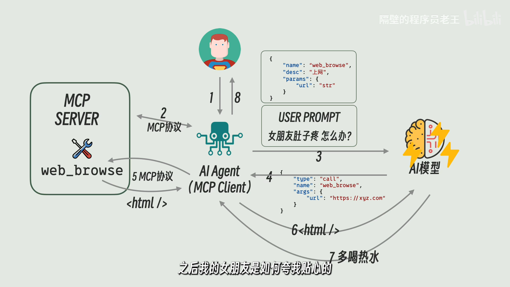
</p>

理解MCP得从AI Agent开始讲起，Agent可以看作是一个能够根据用户指令实现对应功能的智能体，有别于大模型，其本质其实是一个在用户、模型、工具（Agent Tool）之间传话的“智能体”。

AI Agent与大模型之间：有时候大模型的回答并不让人满意或是会给出不规范的回答（反复重试会增加Token的使用），因此引入了Function Call的概念，对User Prompt和Reply都进行了标准化，例如都使用json文件进行传递（相当于将自然语言转化为了计算机语言）。由于Function Call没有一个统一的标准，因此目前System Prompt和Function Call是共存的。

AI Agent与Agent Tool之间：MCP是一个通信协议，专门用来规范Agent与Tool之间是如何交互的，运行Tool的服务叫做MCP Server，调用它的智能体叫做MCP Client。MCP规定了两者如何通信，例如Server需要提供哪些接口（如何查询所有Tool、每个Tool的功能、格式等），除了提供tools，Server还可以提供resource、prompt等数据。

## Agent Skills

mcp是模型借助第三方执行的，skills是模型自己操作
