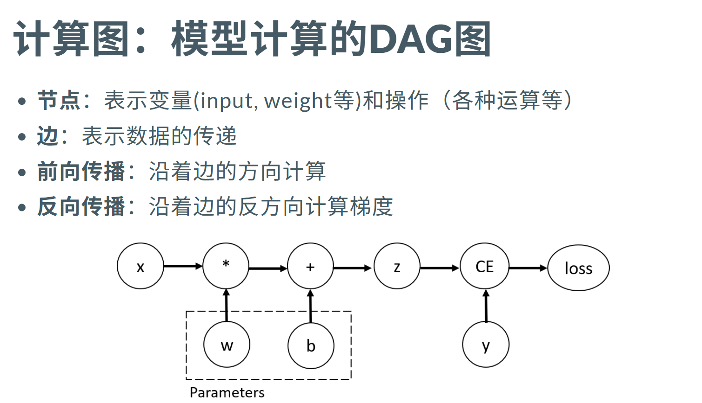

# Pytorch

PyTorch 是一个用于利用 GPU 和 CPU 进行深度学习优化的张量库。

```python
import torch
import torch.optim as optim
import torch.nn as nn

print(torch.__version__)
print(torch.cuda.is_available())
x = torch.rand(3,3)
print(x)
```

## 基本操作

### 1.Tensor和矩阵乘法

Tensor是PyTorch中最基础的数据结构，而矩阵乘法是深度学习模型的核心。

```python
# 标量 (0维)
scalar = torch.tensor(3.14)
print(f"标量: {scalar}, shape: {scalar.shape}")
# 向量 (1维)
vector = torch.tensor([1, 2, 3, 4])
print(f"向量: {vector}, shape: {vector.shape}")
# 矩阵 (2维)
matrix = torch.tensor([[1, 2], [3, 4]])
print(f"矩阵: {matrix}, shape: {matrix.shape}")
# 高维Tensor (常用于输入输出/激活)
high_dim = torch.randn(2, 3, 4, 5)
print(f"高维Tensor: shape: {high_dim.shape}")
```

```python
# 矩阵乘法操作
X = torch.randn(2,3)
print(X)
W = torch.randn(3,4)
print(W)
b = torch.randn(4)
print(b)
# 方法1：@
y1 = X @ W + b
# 方法2：torch.matmul
y2 = torch.matmul(X, W) + b
# 方法3：tensor.matmul
y3 = X.matmul(W) + b
print(y3)

torch.allclose(y1, y2) and torch.allclose(y2, y3)
```

### 2.einsum操作

使用爱因斯坦求和约定，可以直观地描述张量运算。

```python
X = torch.randn(2, 3)
W = torch.randn(3, 4)
# 数学形式: Y_{be} = sum_d X_{bd} * W_{de}
Y = torch.einsum("bd,de->be", X, W)
print(Y.shape)
```

```python
# 批量矩阵乘法
A = torch.randn(10, 3, 4)
B = torch.randn(10, 4, 5)
# 数学形式: Y_{bij} = sum_k A_{bik} * B_{bkj}
C = torch.einsum("bik,bkj->bij", A, B)
# 等价于
D = torch.bmm(A, B) # 需保证两者的shape为[batch, n, m]和[batch, m, p]
print(C.shape, D.shape)
```

### 3.元素乘法

```python
A = torch.randn(2, 3)
print(A)
B = torch.randn(2, 3)
print(B)
# 方法1：*
C = A * B
print(C)
# 方法2：einsum
D = torch.einsum("ij,ij->ij", A, B)
print(torch.allclose(C, D))

# 点积
a = torch.tensor([1, 2, 3])
b = torch.tensor([2, 3, 5])
dot_product = torch.einsum("i,i->", a, b)
dot_product2 = torch.sum(a*b)
print(dot_product, dot_product2)
```

### 4.nn.linear层

``nn.linear``是pytorch最基本的模块之一，其功能是实现一次线性变换：$y=x A^{\top} + b$，其中：
 * x:输入张量
 * A:权重矩阵(out_features × in_features)
 * b:偏置向量(out_features)
 * y:输出张量

```python
linear_layer = nn.Linear(in_features=3, out_features=4, bias=True)
print(f"线性层: {linear_layer}")
print(f"权重shape: {linear_layer.weight.shape}")
print(f"偏置shape: {linear_layer.bias.shape}")
print(f"权重: {linear_layer.weight.data}")
print(f"偏置: {linear_layer.bias.data}")

# 创建输入
x = torch.randn(2, 3)  # batch_size=2, input_dim=3
print(f"\n输入 x: {x}")
print(f"x shape: {x.shape}")

# 前向传播
output = linear_layer(x)
print(f"\n输出: {output}")
print(f"输出shape: {output.shape}")

# 手动计算验证
manual_output = x @ linear_layer.weight.T + linear_layer.bias
print(f"\n手动计算结果: {manual_output}")
print(f"结果相同: {torch.allclose(output, manual_output)}")
```

```python
# 多线性层堆叠
layer1 = nn.Linear(20, 30)
layer2 = nn.Linear(30, 40)
x = torch.randn(128, 20)  # batch_size=128, input_dim=20
print(f"\n输入 x shape: {x.shape}")
# 逐层前向传播
y1 = layer1(x)  # Y1 = XW1
print(f"第一层输出 y1 shape: {y1.shape}")

y2 = layer2(y1)  # Y2 = Y1W2
print(f"第二层输出 y2 shape: {y2.shape}")

# 验证高维情况
x_high_dim = torch.randn(128, 4096, 30, 20)
print(f"\n高维输入 x_high_dim shape: {x_high_dim.shape}")

# nn.Linear会自动处理高维输入，只对最后两个维度进行线性变换
y1_high = layer1(x_high_dim)
print(f"高维输入第一层输出 shape: {y1_high.shape}")

y2_high = layer2(y1_high)
print(f"高维输入第二层输出 shape: {y2_high.shape}")
```

### 5.反向传播和自动求导

#### (1)反向传播

反向传播是深度学习的关键，其核心思想是通过链式法则计算复合函数的导数。

假设构建模型$f$，其参数为$\theta$，目标函数为$f^*$，想要设计一种可用来度量基于$\theta$的模型预测结果与真实结果差距的度量，差距越小，模型越接近所需估计的函数。

训练模型过程：

优化目标$J(\theta)=\frac{1}{n} \sum_{X\in\chi}(f*(X)-f(X;\theta))^2$

使用梯度下降法求偏导，$f^*(X)$通常以真值的形式体现，因此$\frac{\partial }{\partial \theta}J(\theta)$重点关注$f(X;\theta)$

$f(X)=XW-->\frac{\partial }{\partial \theta}f(X)=\frac{\partial }{\partial \theta}(XW)$

通常深度学习模型为复合函数，可利用链式法则求偏导

核心步骤：针对优化目标$J(\theta)$按层回退，一层一层求偏导。

假设$y=XW=f_3(f_2(f_1(X)))$，由链式法则展开得：

$\frac{\partial J}{\partial {\theta_{f_1}}}=\frac{\partial J}{\partial y}\cdot\frac{\partial y}{\partial f_3}\cdot\frac{\partial f_3}{\partial f_2}\cdot\frac{\partial f_2}{\partial f_1}\cdot\frac{\partial f_1}{\partial {\theta_{f_1}}}$

```python
# 创建需要梯度的参数
x = torch.tensor(2.0, requires_grad=True)
w = torch.tensor(3.0, requires_grad=True)
b = torch.tensor(1.0, requires_grad=True)

print(f"输入 x: {x}")
print(f"权重 w: {w}")
print(f"偏置 b: {b}")

# 前向传播: z = x * w + b
z = x * w + b
print(f"\n前向传播结果 z: {z}")

# 定义损失函数 (这里用简单的平方损失)
target = torch.tensor(10.0)
loss = (z - target) ** 2
print(f"目标值: {target}")
print(f"损失值: {loss}")

# 反向传播
loss.backward()

# 查看梯度
print(f"\n梯度信息:")
print(f"∂loss/∂x = {x.grad}")
print(f"∂loss/∂w = {w.grad}")
print(f"∂loss/∂b = {b.grad}")

# 手动验证梯度计算
# loss = (z - target)^2 = (x*w + b - target)^2
# ∂loss/∂x = 2*(x*w + b - target) * w = 2*(z - target) * w
# ∂loss/∂w = 2*(x*w + b - target) * x = 2*(z - target) * x
# ∂loss/∂b = 2*(x*w + b - target) * 1 = 2*(z - target)

manual_grad_x = 2 * (z - target) * w
manual_grad_w = 2 * (z - target) * x
manual_grad_b = 2 * (z - target)

print(f"\n手动计算的梯度:")
print(f"∂loss/∂x = {manual_grad_x}")
print(f"∂loss/∂w = {manual_grad_w}")
print(f"∂loss/∂b = {manual_grad_b}")

print(f"\n梯度计算正确: {torch.allclose(x.grad, manual_grad_x) and torch.allclose(w.grad, manual_grad_w) and torch.allclose(b.grad, manual_grad_b)}")
```

#### (2)计算图：模型计算的DAG图

计算图是一个有向无环图（DAG），其中节点表示张量或操作，边表示数据流和依赖关系。前向传播构建计算图，反向传播沿着图进行梯度计算。
<P align="center">
    
</p>

例子：

线性层：$z=x\cdot\omega +b$

损失函数：$loss$=CrossEntropy($z$,$y$)

前向传播：输出为$z=x\cdot\omega +b$，输出的grad：$\frac{\partial loss}{\partial z}$

反向传播：

$\frac{\partial loss}{\partial \omega}=\frac{\partial loss}{\partial z}\cdot\frac{\partial z}{\partial \omega}=x\cdot \frac{\partial loss}{\partial z}$

$\frac{\partial loss}{\partial b}=\frac{\partial loss}{\partial z}\cdot\frac{\partial z}{\partial b}=\frac{\partial loss}{\partial z}$

$\frac{\partial loss}{\partial x}=\frac{\partial loss}{\partial z}\cdot\frac{\partial z}{\partial x}=\frac{\partial loss}{\partial z}\cdot \omega^\top$

#### (3)使用Pytorch的核心特性进行自动求导

Pytorch会自动构建DAG图（基于`nn.Module`，`Tensor`,`forward`等），设置Tensor对象的`requires_grad=True`即可启动对该Tensor的梯度计算，使用反向传播方法`backward()`自动计算梯度。

一个简单的深度学习模型实例（autograd的无感知使用）：

```python
# 创建简单的回归模型
class SimpleModel(nn.Module):
    def __init__(self, input_dim, hidden_dim, output_dim):
        super(SimpleModel, self).__init__()
        self.linear1 = nn.Linear(input_dim, hidden_dim)
        self.linear2 = nn.Linear(hidden_dim, output_dim)
        self.relu = nn.ReLU() # 激活函数，增加非线性能力

    def forward(self, x):
        x = self.relu(self.linear1(x))
        x = self.linear2(x)
        return x

# 创建模型
model = SimpleModel(input_dim=2, hidden_dim=10, output_dim=1)   
print(f"模型: {model}")                                         

# 创建损失函数和优化器
criterion = nn.MSELoss()                                    #均方误差损失
optimizer = optim.SGD(model.parameters(), lr=0.01)          #随机梯度下降

# 生成简单的训练数据 (y = 2*x1 + 3*x2 + 1 + noise)
torch.manual_seed(42)
X_train = torch.randn(100, 2)
y_train = 2 * X_train[:, 0] + 3 * X_train[:, 1] + 1 + 0.1 * torch.randn(100)
y_train = y_train.unsqueeze(1)  # 添加维度

print(f"训练数据 X shape: {X_train.shape}")
print(f"训练数据 y shape: {y_train.shape}")

# 训练循环
num_epochs = 200
losses = []

# 训练模型
for epoch in range(num_epochs):
    # 前向传播
    outputs = model(X_train)
    loss = criterion(outputs, y_train)
    
    # 反向传播
    optimizer.zero_grad()  # 清零梯度
    loss.backward()        # 计算梯度
    optimizer.step()       # 更新参数
    
    losses.append(loss.item())
    
    if (epoch + 1) % 20 == 0:
        print(f'Epoch [{epoch+1}/{num_epochs}], Loss: {loss.item():.4f}')

print(f"\n最终损失: {losses[-1]:.4f}")

# 测试模型
model.eval()                # 开启评估模式
with torch.no_grad():       # 不计算梯度
    test_input = torch.tensor([[1.0, 2.0]])
    test_output = model(test_input)
    expected = 2 * 1.0 + 3 * 2.0 + 1  # 应该是9
    print(f"\n测试输入: {test_input}")
    print(f"模型预测: {test_output.item():.4f}")
    print(f"期望输出: {expected:.4f}")
    print(f"预测误差: {abs(test_output.item() - expected):.4f}")
```

#### (4)常见反向节点类型 

AddmmBackward: 对应 addmm 的反向（矩阵乘 + 偏置相加），是 `nn.Linear`/`F.linear` 的核心反向(AddBackward或MulBackward)

TBackward: 对应 `transpose` 的反向，是线性层实现里常见的辅助节点（例如 `W.t()`）。反传中将梯度再转回原始维度

AccumulateGrad: 不是算子反向，而是“叶子张量梯度累加”节点。把传来的梯度写入叶子张量（如 `Linear.weight/bias` 或 `requires_grad=True` 的输入）的 `.grad` 中，并按步累加

```python
x = torch.ones(2, 2, requires_grad=True) # 
y = x + 2
z = y * y * 3
out = z.mean()

print(x.grad_fn)  # None，因为x是叶子张量 leaf tensor
print(y.grad_fn)  # <AddBackward0>，表示 y = x + 2
print(z.grad_fn)  # <MulBackward0>，表示 z = y * y * 3
print(out.grad_fn) # <MeanBackward0>，表示 mean 操作
```

#### (5)叶子节点VS非叶子节点

在进行前向传播时进行即时构图，`requires_grad=True`的参与者会被追踪。
- 叶子节点: 叶子是直接由用户创建且需梯度的tensor，其梯度累积在 `.grad`
- 非叶子节点：由运算生成的新tensor，其梯度累计在`.grad_fn`，比如`z=x+y`, z中包含`grad_fn`，是用于记录的Function对象，描述生成该tensor的运算方式，以及反向传播时如何计算梯度

```python
x = torch.tensor([1.0, 2.0, 3.0], requires_grad=True)       # 叶子
y = 5 * x                                                   # 非叶子
print('x: is_leaf=', x.is_leaf, ', grad_fn=', x.grad_fn)
print('y: is_leaf=', y.is_leaf, ', grad_fn=', y.grad_fn)

# 默认非叶子不保留 .grad，调用 retain_grad() 以便教学观察
y.retain_grad()
loss = y.sum()
loss.backward()
print('x.grad:', x.grad)
print('y.grad (retained):', y.grad)
```

#### (6)反向传播的启动过程
  
当执行`out.backward()`时，PyTorch 会从`out.grad_fn`出发，沿着计算图往回追踪，调用每个`grad_fn`对应的`backward()`方法，逐步计算出各个叶子节点（比如参数`x`）的梯度。

#### (7)非标量的Backward

反向传播需要一个起点，对标量来说，就是1。

对于非标量的情况，例如`y=model(x)`，假设`y.shape=[batch,dim]`，直接调用`y.backward()`会报错，因为torch内部不知道到底该对哪个方向做反向传播，需要指定与y同形的上游向量v:`y.backward(gradient=v)`。

```python
x = torch.tensor([1.0, 2.0, 3.0], requires_grad=True)
y = x ** 2  # 非标量输出 shape=(3,)
try:
    y.backward()
except Exception as e:
    print('直接 backward 报错:', e)

v = torch.ones_like(y) / y.numel() # numel()返回元素个数，模拟均值操作的梯度
print(v)
y.backward(gradient=v)
print('提供 gradient 后 x.grad:', x.grad)
```

#### (8)高阶梯度与`create_graph`

如果需要对一阶梯度再求梯度，需要在第一次求导时设置`create_graph=True`，否则一阶梯度将视作常量，无法继续反向（默认一次反向后释放图）。

```python
x = torch.tensor(3.0, requires_grad=True)
y = x**3
# 一阶梯度：dy/dx = 3x^2
(g1,) = torch.autograd.grad(y, x, create_graph=True)
# 二阶梯度：d^2y/dx^2 = 6x
(g2,) = torch.autograd.grad(g1, x)
print('g1=', float(g1), ' g2=', float(g2))
```

#### (9)多次反向与retain_graph

默认反向后会释放计算图；再次反向需 `retain_graph=True` 或重新前向。

```python
x = torch.tensor([1.0, 2.0, 3.0], requires_grad=True)
y = (x**3).sum()
# 第一次 OK
y.backward(retain_graph=True)
print('第一次 x.grad:', x.grad)
# 第二次如不保留图会报错；上面已设置 retain_graph=True，可再次反向
y.backward()
print('第二次 x.grad (累加):', x.grad)
```

#### (10)detach / no_grad / inference_mode 区别

- `x.detach()`: 切断梯度但共享数据存储，常用于停止梯度或缓存。
- `with torch.no_grad()`: 暂停 autograd 记录，常用于推理或 EMA 更新参数；
- `with torch.inference_mode()`: 进一步优化推理内存与速度（不可写视角）。

### 6.Broadcasting广播机制

许多PyTorch操作支持类似Numpy的广播机制，允许不同维度的张量在运行算自动进行维度的扩展。

广播规则总结：
- 从右向左对齐维度
- 维度必须兼容：相等、其中一个为1或其中一个不存在
- 不兼容的维度会自动扩展

#### (1)标量与tensor的广播

```python
a = torch.tensor([1, 2, 3, 4])
b = 2
c = a + b
# 手动方法
d = a + torch.full_like(a, b)
print(f"a + b = {c} 形状:a={a.shape}, c={c.shape}")
print(torch.allclose(c, d))
```

#### (2)不同形状tensor的广播

```python
A = torch.randn(3, 4)
B = torch.ones(4)
print(f"A形状: {A.shape}")
print(f"B形状: {B.shape}")

print("A:", A)
print("B:", B)
# 广播过程：B [4] -> [1, 4] -> [3, 4]
C = A + B
# 手动方法
D = A + B.unsqueeze(0).expand(3, 4)
print(f"A + B形状: {C.shape}")
print("C:", C)
print(f"广播是否成功: {C.shape == (3, 4)}")
print(torch.allclose(C, D))
```

#### (3)复杂情况下的广播

```python
A = torch.randn(2, 3, 4)
B = torch.randn(3, 1) # 对齐大小相同的维度
print(A)
print(B)
result_broadcast = A + B
print(result_broadcast.shape)
print(result_broadcast)
```

#### (4)矩阵乘法中的广播

```python
A = torch.randn(3, 4)
B = torch.randn(2, 4, 5)
result_broadcast = torch.matmul(A, B)
# 等价于
A_expanded = A.unsqueeze(0).expand(2, 3, 4) #(3, 4)->(1, 3, 4)->(2, 3, 4)
result_manual = torch.bmm(A_expanded, B)

print(result_broadcast.shape)
```

#### (5)批量归一化中的广播

```python
x = torch.randn(32, 64, 28, 28)

mean_broadcast = torch.mean(x, dim=(0, 2, 3), keepdim=True)
std_broadcast = torch.std(x, dim=(0, 2, 3), keepdim=True)
normalized_broadcast = (x - mean_broadcast) / (std_broadcast + 1e-8)

print(normalized_broadcast.shape)
```

#### (6)注意力机制中的广播

```python
scores = torch.randn(2, 8, 8)
# print(scores)
mask = torch.tensor([1.0, 1.0, 1.0, 0.0, 0.0, 0.0, 0.0, 0.0])
masked_scores_broadcast = scores + mask.unsqueeze(0).unsqueeze(0)
# print(masked_scores_broadcast)
print(masked_scores_broadcast.shape)
```

### 7.转置操作

`transpose()`侧重于交换两个维度：`def transpose(self, dim0: _int, dim1: _int) -> Tensor`。

而`permute()`可以实现多个维度的重新排列：`def permute(self, dims: _size) -> Tensor: `，其中dims为代表交换顺序的数组。

```python
x = torch.randn(2, 3, 4, 5)
print(f"原始tensor形状: {x.shape}")
# 使用transpoe交换维度
y1 = x.transpose(1, 3)
print(f"transpose(1, 3)后形状: {y1.shape}")
print(f"原始tensor[0, 1, 2, 3] = {x[0, 1, 2, 3]}")
print(f"转置后tensor[0, 3, 2, 1] = {y1[0, 3, 2, 1]}")
print(f"两者是否相等: {x[0, 1, 2, 3] == y1[0, 3, 2, 1]}")
```

```python
# 使用permute重排维度
y2 = x.permute(0, 3, 1, 2)
print(f"permute(0, 3, 1, 2)后形状: {y2.shape}")
print(f"原始tensor[0, 1, 2, 3] = {x[0, 1, 2, 3]}")
print(f"permute后tensor[0, 3, 1, 2] = {y2[0, 3, 1, 2]}")
print(f"两者是否相等: {x[0, 1, 2, 3] == y2[0, 3, 1, 2]}")
```

转置操作导致内存上不连续：转置时并没有真的搬运内存中的数据，只是修改了“如何读取数据”的规则（元数据），具体表现为，逻辑上相邻的元素，在物理内存中不再相邻。

```python
# 连续性问题
print(f"原始tensor是否连续: {x.is_contiguous()}")
print(f"transpose后是否连续: {y1.is_contiguous()}")
print(f"permute后是否连续: {y2.is_contiguous()}")
```

```python
x = torch.tensor([[1, 2, 3],
                  [4, 5, 6]])
# 线性内存 |1|2|3|4|5|6|
y = torch.transpose(x, 0, 1)
# 内存上仍然是 |1|2|3|4|5|6|，但是读取[1, 4]的4时跳跃内存
```

### 8.形状变换操作：view vs reshape

`view()`与`reshape()`的主要区别在于能否处理不连续tensor。

```python
x = torch.randn(2, 3, 4)
# view 要求内存连续，否则报错
y = x.view(6, 4)
print(y.shape)   # [6, 4]

# reshape 不连续时自动复制内存
xt = x.transpose(0, 1)   # 不连续
z = xt.reshape(-1, 4)    # 不报错
print(z.shape)  # [6, 4]

# contiguous() 手动让内存连续后 view
z2 = xt.contiguous().view(-1, 4)
print(z2.shape)
print(x.is_contiguous())
```

#### view操作

```python
y1 = x.view(6, 4)
print(y1.is_contiguous())
```

#### reshape操作

```python
y2 = x.reshape(6, 4)
print(y2.is_contiguous())
```

```python
# view()处理不连续tensor会报错
x_transposed = x.transpose(0, 1)
print(f"转置后是否连续: {x_transposed.is_contiguous()}")
try:
    y3 = x_transposed.view(6, 4)
except RuntimeError as e:
    print("view报错信息:", e)
```

```python
# reshape() 会自动处理连续性问题
y4 = x_transposed.reshape(12, 2)
print(f"reshape()成功: {y4.shape}")
```

```python
# 验证是否共享内存，即是否会随着原始tensor修改数据而改变
x[0, 0, 0] = 1
print(f"修改原始tensor后，view结果: {y1[0, 0]}")
print(f"修改原始tensor后，reshape结果: {y2[0, 0]}")
x[0, 0, 0] = 999
print(f"修改原始tensor后，view结果: {y1[0, 0]}")
print(f"修改原始tensor后，reshape结果: {y2[0, 0]}")
```

### 9.维度操作

使用`squeeze`进行某个维度的移除，使用`unsqueeze`在指定位置插入大小为1的维度。

```python
x = torch.randn(1, 3, 1, 4)
print(x.shape)
# 移除所有大小为1的维度
y1 = x.squeeze()
print(y1.shape)
# 移除指定维度
y2 = x.squeeze(0)
print(y2.shape)
```

```python
x = torch.randn(3, 4)
print(x.shape)
y1 = x.unsqueeze(0)
print(y1.shape)
y2 = x.unsqueeze(-1)
print(y2.shape)
y3 = x.unsqueeze(1)
print(y3.shape)
```

使用`torch.flatten()`来合并某个维度

torch.flatten(input, start_dim=0, end_dim=-1) → Tensor

```python
t = torch.tensor([[[1, 2],
                   [3, 4]],
                  [[5, 6],
                   [7, 8]]])
print(t.shape)
print(torch.flatten(t))
print(torch.flatten(t).shape)
print(torch.flatten(t, start_dim=1))
print(torch.flatten(t, start_dim=1).shape)
```

### 10.索引、分散与选择

`gather()`用来按照索引收集元素并创建新tensor，遵循以下规则（以一个三维tensor为例）：

```text
        out[i][j][k] = input[index[i][j][k]][j][k]  # if dim == 0
        out[i][j][k] = input[i][index[i][j][k]][k]  # if dim == 1
        out[i][j][k] = input[i][j][index[i][j][k]]  # if dim == 2
```

```python
x = torch.randn(3, 4)
print(x)
# 索引的维度需要和目标tensor匹配，除了dim的维度
indices = torch.tensor([0, 2, 1])
# 在第1维上按索引收集元素
y1 = torch.gather(x, 1, indices.unsqueeze(1))
print(y1)
print(y1.shape)
# 手动验证
print(f"第0行选择第{indices[0]}列: {x[0, indices[0]]}, 结果: {y1[0, 0]}")
print(f"第1行选择第{indices[1]}列: {x[1, indices[1]]}, 结果: {y1[1, 0]}")
print(f"第2行选择第{indices[2]}列: {x[2, indices[2]]}, 结果: {y1[2, 0]}")
```

`scatter_()`函数按照索引来将目标tensor中的值替换为某个tensor中的值

```python
x_scatter = torch.zeros(3, 4)
values = torch.randn(3, 2)
indices_scatter = torch.tensor([[0, 2], [1, 3], [0, 1]])
print(f"目标tensor:\n{x_scatter}")
print(f"要分散的值:\n{values}")
print(f"分散索引:\n{indices_scatter}")
# 分散元素
x_scatter.scatter_(1, indices_scatter, values)
print(f"scatter后结果:\n{x_scatter}")
```

`index_select()`函数可以按照索引选择并提取整行/整列元素

```python
# 按索引选择列
x = torch.randn(5, 6)
print(x)
indices = torch.tensor([0, 2, 4])
selected = torch.index_select(x, 1, indices)
print(f"原始tensor形状: {x.shape}")
print(f"选择的索引: {indices}")
print(f"选择结果形状: {selected.shape}")
print(f"选择结果:\n{selected}")
```

`masked_select()`函数按照掩码选择并保留元素，结果为一维tensor

```python
# 创建掩码
x = torch.randn(3, 4)
mask = x > 0.5
print(f"原始tensor:\n{x}")

# 按掩码选择
selected_values = torch.masked_select(x, mask)
print(f"按掩码选择的值: {selected_values}")
print(f"选择的值数量: {len(selected_values)}")
```

### 11.插入元素

```python
x = torch.randn(1, 2)
print(x)
y1 = torch.stack((x, x)) # 等价于 torch.stack((x, x), dim=0)
print("y1:",y1)
print(y1.shape)
y2 = torch.stack((x, x), dim=1)
print("y2:",y2)
print(y2.shape)
y3 = torch.stack((x, x), dim=2)
print("y3:",y3)
print(y3.shape)
y4 = torch.stack((x, x), dim=-1)
print("y4:",y4)
print(y4.shape)
```

### 12.外积

```python
v1 = torch.arange(1., 5.)
print(v1)
v2 = torch.arange(1., 4.)
print(v2)
print(torch.outer(v1, v2))
```

---

## 模型训练

### 1.Dataset 与 DataLoader

`torch.utils.data.Dataset` 封装数据集，`DataLoader` 负责批量采样与多进程加载。

```python
from torch.utils.data import Dataset, DataLoader, random_split
import torchvision.transforms as T

# ===== 自定义 Dataset =====
class MyDataset(Dataset):
    def __init__(self, X, y, transform=None):
        self.X = X
        self.y = y
        self.transform = transform

    def __len__(self):
        return len(self.X)

    def __getitem__(self, idx):
        sample = self.X[idx]
        if self.transform:
            sample = self.transform(sample)
        return sample, self.y[idx]

# ===== 构建 DataLoader =====
torch.manual_seed(0)
X = torch.randn(1000, 3, 32, 32)
y = torch.randint(0, 10, (1000,))
dataset = MyDataset(X, y)

# 划分训练/验证集
train_ds, val_ds = random_split(dataset, [800, 200])

train_loader = DataLoader(train_ds, batch_size=32, shuffle=True,
                          num_workers=0, pin_memory=False)
val_loader   = DataLoader(val_ds,   batch_size=64, shuffle=False,
                          num_workers=0)

# 遍历一个 batch
for imgs, labels in train_loader:
    print(f"batch imgs: {imgs.shape}, labels: {labels.shape}")
    break
```

常用参数说明：

| 参数 | 说明 |
|---|---|
| `batch_size` | 每批样本数 |
| `shuffle` | 每 epoch 打乱（训练集 True，验证集 False） |
| `num_workers` | 数据加载子进程数，Windows 下通常设 0 |
| `pin_memory` | 锁页内存，GPU 训练时可加速 H2D 拷贝 |
| `drop_last` | 丢弃不足一批的最后样本 |

---

### 2.损失函数

```python
import torch.nn.functional as F

# ===== 回归损失 =====
pred = torch.randn(8, 1)
target = torch.randn(8, 1)

mse  = nn.MSELoss()(pred, target)           # 均方误差
mae  = nn.L1Loss()(pred, target)            # 平均绝对误差
huber = nn.HuberLoss(delta=1.0)(pred, target) # Huber（对异常值鲁棒）

# ===== 分类损失 =====
logits = torch.randn(8, 10)     # [batch, num_classes]，未经 softmax
labels = torch.randint(0, 10, (8,))

ce   = nn.CrossEntropyLoss()(logits, labels)    # 内部含 log_softmax
bce  = nn.BCEWithLogitsLoss()(torch.randn(8,1), torch.rand(8,1))  # 二分类

print(f"MSE={mse:.4f} MAE={mae:.4f} Huber={huber:.4f} CE={ce:.4f}")
```

---

### 3.Optimizer 与 lr_scheduler

```python
model = nn.Linear(10, 1)

# ===== 常用 Optimizer =====
sgd   = optim.SGD(model.parameters(), lr=0.01, momentum=0.9, weight_decay=1e-4)
adam  = optim.Adam(model.parameters(), lr=1e-3, betas=(0.9, 0.999))
adamw = optim.AdamW(model.parameters(), lr=1e-3, weight_decay=1e-2)  # 推荐

# ===== 常用 lr_scheduler =====
# StepLR: 每 step_size 个 epoch 乘以 gamma
step_sched = optim.lr_scheduler.StepLR(adamw, step_size=10, gamma=0.1)

# CosineAnnealingLR: 余弦退火到 eta_min
cos_sched  = optim.lr_scheduler.CosineAnnealingLR(adamw, T_max=50, eta_min=1e-6)

# OneCycleLR: 先升后降，常配合 DataLoader step
onecycle   = optim.lr_scheduler.OneCycleLR(adamw, max_lr=1e-2,
                                           steps_per_epoch=100, epochs=50)

# scheduler.step() 放在 optimizer.step() 之后
```

### 4.完整训练循环

```python
import torch, torch.nn as nn, torch.optim as optim
from torch.utils.data import DataLoader, TensorDataset

# ===== 准备数据 =====
X = torch.randn(500, 8)
y = torch.randint(0, 3, (500,))
ds = TensorDataset(X, y)
train_loader = DataLoader(ds[:400], batch_size=32, shuffle=True)
val_loader   = DataLoader(ds[400:], batch_size=64)

# ===== 模型 =====
model = nn.Sequential(
    nn.Linear(8, 32), nn.ReLU(),
    nn.Linear(32, 3)
)
criterion = nn.CrossEntropyLoss()
optimizer = optim.AdamW(model.parameters(), lr=1e-3)
scheduler = optim.lr_scheduler.CosineAnnealingLR(optimizer, T_max=20)

device = torch.device("cuda" if torch.cuda.is_available() else "cpu")
model.to(device)

# ===== 训练函数 =====
def train_one_epoch(model, loader, criterion, optimizer, device):
    model.train()
    total_loss, correct = 0.0, 0
    for X_batch, y_batch in loader:
        X_batch, y_batch = X_batch.to(device), y_batch.to(device)
        optimizer.zero_grad()            # 1. 清零梯度
        logits = model(X_batch)          # 2. 前向传播
        loss = criterion(logits, y_batch)# 3. 计算损失
        loss.backward()                  # 4. 反向传播
        optimizer.step()                 # 5. 更新参数
        total_loss += loss.item() * len(X_batch)
        correct += (logits.argmax(1) == y_batch).sum().item()
    n = len(loader.dataset)
    return total_loss / n, correct / n

# ===== 验证函数 =====
def evaluate(model, loader, criterion, device):
    model.eval()
    total_loss, correct = 0.0, 0
    with torch.no_grad():
        for X_batch, y_batch in loader:
            X_batch, y_batch = X_batch.to(device), y_batch.to(device)
            logits = model(X_batch)
            total_loss += criterion(logits, y_batch).item() * len(X_batch)
            correct += (logits.argmax(1) == y_batch).sum().item()
    n = len(loader.dataset)
    return total_loss / n, correct / n

# ===== 训练主循环 =====
for epoch in range(20):
    tr_loss, tr_acc = train_one_epoch(model, train_loader, criterion, optimizer, device)
    val_loss, val_acc = evaluate(model, val_loader, criterion, device)
    scheduler.step()
    if (epoch + 1) % 5 == 0:
        print(f"[{epoch+1:2d}/20] train loss={tr_loss:.4f} acc={tr_acc:.3f} | "
              f"val loss={val_loss:.4f} acc={val_acc:.3f} | "
              f"lr={scheduler.get_last_lr()[0]:.2e}")
```

### 5.模型保存与加载（Checkpoint）

```python
# ===== 只保存权重（推荐） =====
torch.save(model.state_dict(), "model.pth")

# 加载
model.load_state_dict(torch.load("model.pth", map_location=device))
model.eval()

# ===== 完整 checkpoint（恢复训练） =====
checkpoint = {
    "epoch": 20,
    "model_state": model.state_dict(),
    "optim_state": optimizer.state_dict(),
    "sched_state": scheduler.state_dict(),
    "val_loss": val_loss,
}
torch.save(checkpoint, "checkpoint.pth")

# 恢复
ckpt = torch.load("checkpoint.pth", map_location=device)
model.load_state_dict(ckpt["model_state"])
optimizer.load_state_dict(ckpt["optim_state"])
scheduler.load_state_dict(ckpt["sched_state"])
start_epoch = ckpt["epoch"]
```

### 6.ONNX 导出与验证

```python
import torch.onnx

model.eval()
dummy_input = torch.randn(1, 8).to(device)  # 和实际输入 shape 一致

torch.onnx.export(
    model,
    dummy_input,
    "model.onnx",
    opset_version=17,               # 推荐 ≥ 11，RKNN 通常要求 ≤ 17
    input_names=["input"],
    output_names=["output"],
    dynamic_axes={                  # 支持动态 batch
        "input":  {0: "batch_size"},
        "output": {0: "batch_size"},
    },
)
print("ONNX 导出完成")

# ===== 用 onnxruntime 验证精度 =====
try:
    import onnxruntime as ort
    import numpy as np

    sess = ort.InferenceSession("model.onnx", providers=["CPUExecutionProvider"])
    inp_name = sess.get_inputs()[0].name
    x_np = dummy_input.cpu().numpy()

    ort_out = sess.run(None, {inp_name: x_np})[0]
    with torch.no_grad():
        pt_out = model(dummy_input).cpu().numpy()

    print("最大误差:", np.abs(ort_out - pt_out).max())
except ImportError:
    print("onnxruntime 未安装，跳过验证")
```

ONNX 导出常见坑：

| 问题 | 原因 | 解决 |
|---|---|---|
| 算子不支持 | opset 版本太低 | 升级 opset ≥ 11 |
| 动态 shape 报错 | 未设 dynamic_axes | 添加 dynamic_axes 参数 |
| RKNN 不支持 | 含复杂 attention/自定义算子 | 替换为 RKNN 白名单算子 |
| 精度差 | FP16/BF16 量化 | 保持 FP32 导出后再做量化 |

### 7.验证集的作用

验证集用于评估模型在未见过数据上的性能，监控过拟合，并指导超参数调整。训练过程中通过定期在验证集上评测指标（如准确率、损失）来判断模型是否在泛化能力上有所提升。

训练时模型只见过 train 集的图片，会过拟合训练数据。val 集是模型从未训练过的图片，用来衡量模型对新数据的泛化能力。

Ultralytics 训练过程中会在每个 epoch 结束后自动在 val 集上评估，best.pt 保存的就是val mAP@0.5 最高的那个 epoch 的权重，而不是训练 loss 最低的。

```bash
yolo detect val model=yolov8n.pt       data=coco_subset.yaml  # 基线
yolo detect val model=best.pt          data=coco_subset.yaml  # 微调后
yolo detect val model=best.onnx        data=coco_subset.yaml  # ONNX 转换后
```

### 8.目标检测评估指标：mAP

#### (1) 基础概念：IoU / TP / FP / FN

**IoU（Intersection over Union）**= 预测框与真值框的交集面积 / 并集面积

```text
          ┌──────────────┐
          │   GT box     │
          │    ┌─────────┼──────┐
          │    │  交集   │      │
          └────┼─────────┘  预测框
               └────────────────┘

IoU = 交集面积 / (GT面积 + 预测框面积 - 交集面积)
```

给定 IoU 阈值（如 0.5），对每个预测框判断：

| 情况 | 含义 |
|---|---|
| TP（True Positive） | IoU ≥ 阈值，且类别正确 |
| FP（False Positive） | IoU < 阈值，或类别错误（误检） |
| FN（False Negative） | 真值框没有对应预测框（漏检） |

$$\text{Precision} = \frac{TP}{TP + FP} \qquad \text{Recall} = \frac{TP}{TP + FN}$$

```python
def compute_iou(box1, box2):
    """box 格式: [x1, y1, x2, y2]"""
    inter_x1 = max(box1[0], box2[0])
    inter_y1 = max(box1[1], box2[1])
    inter_x2 = min(box1[2], box2[2])
    inter_y2 = min(box1[3], box2[3])

    inter_area = max(0, inter_x2 - inter_x1) * max(0, inter_y2 - inter_y1)
    area1 = (box1[2] - box1[0]) * (box1[3] - box1[1])
    area2 = (box2[2] - box2[0]) * (box2[3] - box2[1])

    return inter_area / (area1 + area2 - inter_area + 1e-8)

pred = [50, 50, 150, 150]
gt   = [60, 60, 160, 160]
print(f"IoU = {compute_iou(pred, gt):.4f}")  # ≈ 0.68
```

#### (2) P-R 曲线与 AP

将同一类别的所有预测框按**置信度从高到低排序**，逐步增大召回范围，记录每一步的 Precision 和 Recall，绘制 P-R 曲线。

**AP（Average Precision）= P-R 曲线下面积**

```python
import numpy as np

def compute_ap(recalls, precisions):
    """
    全点插值法（COCO 标准）。
    recalls, precisions 须按 recall 升序排列。
    """
    mrec = np.concatenate(([0.0], recalls, [1.0]))
    mpre = np.concatenate(([1.0], precisions, [0.0]))

    # 从右向左取最大，消除锯齿使曲线单调不增
    for i in range(len(mpre) - 2, -1, -1):
        mpre[i] = max(mpre[i], mpre[i + 1])

    # 矩形积分求面积
    idx = np.where(mrec[1:] != mrec[:-1])[0]
    ap = np.sum((mrec[idx + 1] - mrec[idx]) * mpre[idx + 1])
    return float(ap)

recalls    = np.array([0.1, 0.2, 0.4, 0.5, 0.7, 0.8, 1.0])
precisions = np.array([1.0, 0.9, 0.8, 0.7, 0.6, 0.5, 0.4])
print(f"AP = {compute_ap(recalls, precisions):.4f}")
```

#### (3) mAP：多类别均值

$$\text{mAP} = \frac{1}{N_{\text{class}}} \sum_{c=1}^{N_{\text{class}}} AP_c$$

对每个类别单独计算 AP，再取所有类别的均值。

#### (4) mAP@0.5 vs mAP@0.5:0.95

| 指标 | IoU 阈值 | 标准 | 说明 |
|---|---|---|---|
| `mAP@0.5` | 0.5（单点） | PASCAL VOC | 宽松，常用于快速对比 |
| `mAP@0.5:0.95` | 0.5, 0.55, …, 0.95（10点均值） | COCO | 严格，更能反映定位精度 |
| `mAP@0.75` | 0.75（单点） | COCO 子项 | 强调精准定位 |

```text
YOLOv8n 在 COCO val2017 上的典型结果：
  mAP@0.5       ≈ 0.526
  mAP@0.5:0.95  ≈ 0.372

差距大 → 模型能检测到目标，但定位精度仍有提升空间。
```

#### (5) 用 Ultralytics 读取 mAP

mAP计算完整过程：
```text
输入：val 集图片 + 对应 GT 标注（person/car/bicycle 的框坐标和类别）

第一步：推理
  对每张 val 图跑模型 → 得到 N 个预测框，每个带 [x1,y1,x2,y2, conf, class]

第二步：对每个类别（如 person）单独计算 AP
  1. 收集该类别所有预测框，按 conf 从高到低排序
  2. 逐个判断每个预测框：
       IoU(pred, GT) ≥ 0.5 且未被匹配过 → TP
       否则 → FP
  3. 按顺序累积计算 Precision 和 Recall，得到一组 (R, P) 点
  4. 绘制 P-R 曲线，计算曲线下面积 = AP_person

第三步：mAP = 所有类别 AP 的均值
  mAP@0.5 = (AP_person + AP_car + AP_bicycle) / 3
```

具体实现：

```python
from ultralytics import YOLO

model = YOLO("runs/train/yolov8n_subset/weights/best.pt")
metrics = model.val(data="coco_subset.yaml", device=0)

print(f"mAP@0.5       = {metrics.box.map50:.4f}")
print(f"mAP@0.5:0.95  = {metrics.box.map:.4f}")
print(f"Precision     = {metrics.box.mp:.4f}")
print(f"Recall        = {metrics.box.mr:.4f}")

# 按类别查看 AP
for i, name in enumerate(model.names.values()):
    print(f"  [{name:10s}] AP@0.5 = {metrics.box.ap50[i]:.4f}")
```

#### (6) 常见误解与坑点

| 误解 | 实际情况 |
|---|---|
| mAP 越高在实际场景越好 | mAP 依赖测试集分布，需在自己的场景数据上验证 |
| mAP@0.5=0.9 接近完美 | IoU=0.5 很宽松，框可能偏移很多像素 |
| 80类→3类微调后 mAP 应该更高 | 需在子集 val 上评估；若用全 COCO val，77个类的 GT 会产生大量 FN |
| 量化后 mAP 损失可忽略 | YOLOv8n 等轻量模型 INT8 量化后通常损失 1-3%，必须实测 |
| Precision 高代表模型好 | Precision 和 Recall 有 trade-off，调置信度阈值会相互影响 |

### 9.YOLOv8n 微调训练实战（Ultralytics）

> 目标：在 COCO person/car/bicycle 子集上微调 YOLOv8n，走通完整训练→ONNX 导出链路。

#### (1) 环境准备（Windows 本地，conda pytorch 环境）

```bash
# 当前环境：PyTorch 2.4.1 + CUDA 12.4，RTX 4060 Laptop 8GB
conda activate pytorch
pip install ultralytics
pip install onnxruntime-gpu    # ONNX GPU 推理验证
pip install onnxslim           # ONNX 图优化（simplify 依赖）

# 验证 GPU 可用
python -c "import torch; print(torch.cuda.get_device_name(0))"
```

#### (2) 提取 COCO 子集

```python
# ===== coco_subset.py =====
import json, shutil, os
from pathlib import Path

COCO_ANN = "coco/annotations/instances_train2017.json"
COCO_IMG = "coco/images/train2017"
OUT_DIR   = "coco_subset"
TARGET_CATS = {"person", "car", "bicycle"}
MAX_PER_CAT = 7000      # 约 2 万张

with open(COCO_ANN) as f:
    coco = json.load(f)

cat_name2id = {c["name"]: c["id"] for c in coco["categories"]}
target_ids  = {cat_name2id[n] for n in TARGET_CATS if n in cat_name2id}

# 过滤 annotation
kept_img_ids = set()
for ann in coco["annotations"]:
    if ann["category_id"] in target_ids:
        kept_img_ids.add(ann["image_id"])

kept_imgs = [img for img in coco["images"] if img["id"] in kept_img_ids]
kept_imgs = kept_imgs[:MAX_PER_CAT * len(TARGET_CATS)]  # 限制数量

out_img_dir = Path(OUT_DIR) / "images" / "train"
out_img_dir.mkdir(parents=True, exist_ok=True)
for img in kept_imgs:
    src = Path(COCO_IMG) / img["file_name"]
    if src.exists():
        shutil.copy(src, out_img_dir / img["file_name"])

print(f"共选取 {len(kept_imgs)} 张图")
```

#### (3) 数据集配置文件

```yaml
# coco_subset.yaml
path: ./coco_subset
train: images/train
val:   images/val

nc: 3
names: ["person", "car", "bicycle"]
```

> 标注格式：Ultralytics 使用 YOLO 格式（`.txt`，`class cx cy w h` 归一化），可用官方 `json2yolo` 工具转换。

#### (4) 训练指令

```bash
# 方式 1：命令行（RTX 4060 Laptop 8GB，batch=32 显存占用约 4-5GB）
yolo detect train \
    data=coco_subset.yaml \
    model=yolov8n.pt \
    epochs=50 \
    imgsz=640 \
    batch=32 \
    device=0 \
    cache=True \
    workers=4 \
    project=runs/train \
    name=yolov8n_subset
```

```python
# 方式 2：Python API
from ultralytics import YOLO
model = YOLO("yolov8n.pt")
results = model.train(
    data="coco_subset.yaml",
    epochs=50,
    imgsz=640,
    batch=32,       # RTX 4060 Laptop 8GB 下稳定
    device=0,       # 0 = 第一块 GPU
    cache=True,     # 图片缓存到 RAM，消除 IO 瓶颈
    workers=4,      # Windows 下可尝试 2-4，报错改 0
    project="runs/train",
    name="yolov8n_subset",
)
```

> **显存不足降级方案**：`batch=16 imgsz=640`（约 2-3GB）；或 `batch=32 imgsz=416`。

#### (5) 导出 ONNX

```bash
yolo export model=runs/train/yolov8n_subset/weights/best.pt \
             format=onnx opset=17 simplify=True
```

```python
from ultralytics import YOLO
model = YOLO("runs/train/yolov8n_subset/weights/best.pt")
model.export(format="onnx", opset=17, simplify=True)
```

#### (6) 精度验证对比

```bash
# 微调前（官方预训练权重）
yolo detect val model=yolov8n.pt data=coco_subset.yaml

# 微调后
yolo detect val model=runs/train/yolov8n_subset/weights/best.pt data=coco_subset.yaml
```

验收标准：量化后 mAP 损失 < 3%，板端推理结果无明显退化。

| 阶段 | 权重 | mAP@0.5 |
|---|---|---|
| 微调前（预训练） | yolov8n.pt | 记录基线 |
| 微调后 | best.pt | 应有提升 |
| ONNX 推理 | best.onnx | 与 best.pt 误差 < 0.1% |
